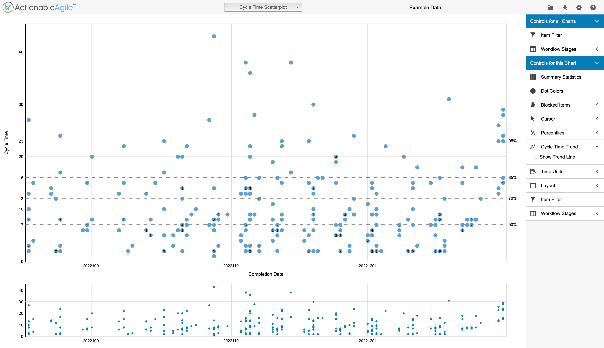
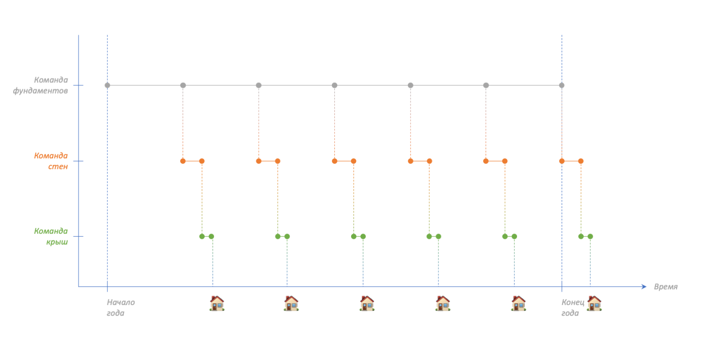
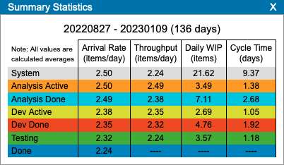
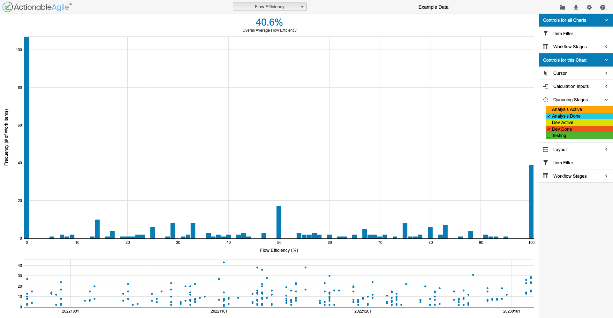
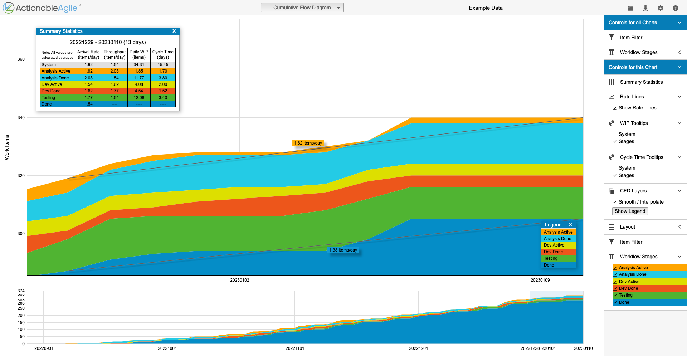
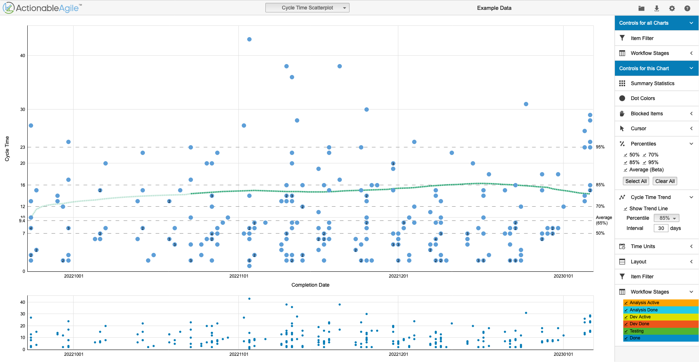

# Как обеспечить «вдвое больше за половину времени»

Книга [Scrum](https://www.mann-ivanov-ferber.ru/books/scrum/?ysclid=lcx7cqqs62463531052) авторства Джеффа Сазерленда, соавтора одноимённой методологии, в российском переводе имеет следующий подзаголовок: «Революционный метод управления проектами». В оригинале подзаголовок отличается: The Art of Doing Twice the Work in Half the Time. Что-то похожее на «Искусство делать вдвое больше работы за половину времени». Нельзя быть уверенным, что вдвое больше сделанной работы принесёт вдвое больше пользы, поэтому это слово в заголовке статьи я деликатно опустил.


Теоретический менеджмент полон дедушек. Я читал работы Деминга (William Deming), Голдратта (Eliyahu Goldratt), Оно (Taiichi Ohno) и Друкера (Peter Drucker). Слышал о работах Акоффа (Russell Ackoff) и Джурана (Joseph Juran). Во всём прочитанном мне понравилось человечное и заботливое отношение к работающим людям. Тайити Оно был, пожалуй, строже остальных, но всё ещё очень человечен. Его можно понять, ведь он практиковал, ходил и убеждал людей, а нервы для этого иногда заканчиваются. Ни в одной из книг не было ничего похожего на «эксплуатируйте людей каждый день всё пуще, пока они не упадут без сил». Питер Друкер в своей книге [Management Rev Ed](https://www.amazon.com/Management-Rev-Ed-Peter-Drucker/dp/0061252662) даже дал нам, менеджменту 21-го века, подсказку, чем нужно заниматься:

> Важнейшим и действительно уникальным вкладом менеджмента в двадцатом веке было пятидесятикратное увеличение производительности физического труда на производстве.

> Самый важный вклад, который должен внести менеджмент в двадцать первом веке, — это повышение производительности умственного труда и работников умственного труда.

Более двадцати лет прошло с начала века. Как близко мы подошли к достижению этой амбициозной цели? Мне видится, что мы ещё далековато. Давайте посмотрим, где мы сейчас находимся, какие у нас есть проблемы, и что с ними можно сделать.

## Разбор широко распространённого подхода к эффективности процесса разработки ПО

Чем мне нравится выражение «вдвое больше за половину времени», так это тем, что оно ёмко описывает, насколько более эффективной может стать наша работа. Это приятное чувство достаточно быстро упирается в вопрос, а что вообще такое эффективность в разработке ПО? Да и как понять, что со временем мы становимся эффективнее?

В конце концов, зачем нам вообще нужна эффективность? Она нужна нам затем, чтобы достигать тех же желаемых результатов с меньшими затратами. Во многих случаях это означает, что у нас появляется возможность отправить высвобожденное на решение других насущных проблем и улучшать качество жизни.

Люди, практикующие Скрам, предлагают в качестве мерила сложности задачки и требуемых на неё затрат использовать story points. Несмотря на всю распространённость термина, какого-то внятного и легко соскальзывающего с языка перевода мне найти не удалось. В уже упомянутой книжке Scrum используется слово «очки». Переводчики предлагают «относительные единицы сложности». К счастью, надолго на них мы останавливаться не будем. Вот мой перевод [определения этого термина со scrum.org](https://www.scrum.org/resources/blog/why-do-we-use-story-points-estimating):


> Story Point — относительная единица измерения, установленная и используемая скрам-командой для оценки относительной сложности требований.

Оценка задачи в SP — это такой множитель сложности относительно базовой задачки. То есть вы и я примерно представляем, сколько усилий потребовалось для реализации той самой не очень сложной задачки. Если я говорю, что новая задачка будет стоить 3 SP, то значит мне она кажется втрое более сложной, чем предыдущая. Тем не менее это всего лишь предположение, и кто знает, что там впереди.

Снова вернёмся к эффективности. Если мы разработаем за спринт задач на 25 SP, будем ли мы лучше, чем спринт назад, когда было вышло 15 SP? Или же мы просто были поосторожнее и поставили оценки повыше для такого же объёма работ? А что это такое за «такой же объём работ», как мы их сравниваем? У нас в разработке ПО нет повторяющейся в промышленных масштабах одинаковой работы. Мы проектируем и реализуем фабрики по преобразованию информации, а вот они уже предоставляют нужные услуги. Так как мы вообще можем говорить об эффективности в нашей индустрии?

Говорить об эффективности можно осторожно начать от обратного. Мы намеренно можем замедлить решение поставленной задачи. Можем попрокрастинировать, а можем прыгать от одной задачи к другой, замедляя тем самым выполнение каждой отдельной задачи. Если вы любите псевдопараллелизм, то вам сейчас хорошо. Итак, если что-то можно делать менее эффективно, то есть надежда, что и более эффективно это что-то можно делать. Но будут ли полезны в нашем путешествии стори поинты? Я не вижу их пользы для дальнейшего рассмотрения. При желании или же ненамеренно их можно совершенно легко исказить. Нам нужно меру получше.

> Определяем объект измерения

Давайте пока не будем спешить с измерением. Ведь надо сначала выяснить, что измерять. Какой-то внятной единицы работы для всей индустрии программного обеспечения я предложить не могу. К счастью, этого и не требуется. Достаточно той самой идеи относительности, которую мы встретили выше. Но только не в том разнообразном виде, ведущему к множителям, а в более простом: «мы здесь занимаемся похожими вещами». Этот осмысленный шаг в развитии программного продукта может быть эпиком, задачей, новой функциональностью или чем-либо ещё, характеризующим однократное движение в развитии разрабатываемой системы.

Вот пример трёх уровней шагов:

```
Ценная для пользователя функция ПО:
 ⎿ Её часть, удобная кроссфункциональной команде разработки:
   ⎿ Конкретная задачка внутри этой части (например, доработка сервера)
```

Чтобы доработка была улучшаемой, ей достаточно обладать всего лишь двумя свойствами:

1. Иметь конкретное время начала и завершения;
2. Случаться регулярно.

Для простоты в оставшейся части статьи я буду использовать слово «доработка». Не все доработки одинаковы. Выше я привёл пример существования доработок трёх различных типов.

Доработка должна происходить регулярно. Не могу назвать какую-либо конкретную частоту, но важность повторяемости будет видна позже. Требование к её наличию исходит из того, что нельзя быть максимально эффективным с самого начала, но можно становиться эффективнее со временем по мере новых итераций. Так работает Скрам, так работает производственная система «Тойоты», так работает наука. Нам нужна повторяемость для того, чтобы уловить доработку и последовательно её улучшать.

Сделать сразу что-то наиболее эффективным образом можно лишь случайно. Чем больше составных частей содержит определённое действие, тем меньше вероятность такой случайности. Можно подготовиться заранее. Но сама возможность подготовиться заранее свидетельствует, что доработка или её части уже когда-то ранее случались, и имеется некоторое знание. К абсолютно новым явлениям нечего готовить. С другой стороны, едва ли мы встречаемся с такими явлениями в нашей жизни. Часть предыдущего опыта так или иначе всегда остаётся востребованной.

Объект нашего измерения и улучшения — доработка определённого типа.

## Как измерить доработку определённого типа?

Может показаться, что предыдущая часть статьи ничего не добавляет. Ну существуют доработки определённого типа, но и что с того? Чем это лучше задач, измеренных с помощью относительных единиц, размеров футболок или видов животных?

Но название — это не единственное наше приобретение. У доработки есть также две временные метки, и нам доступна её продолжительность. Продолжительность — это потрясающее приобретение. Во-первых, она относится к понятному для очень многих языку:

— Сколько потребовалось времени, чтобы сделать эпик?
— 39 дней.

Во-вторых, если есть знакомая многим продолжительность, то и есть и возможность над ней работать с понятным для многих результатом.

## Получаем ли мы что-нибудь ещё?

Второе предъявленное к доработке требование, регулярность, даёт нам так много, что непросто в это поверить. Во-первых, мы получаем поток доработок определённого типа. Вот мой перевод определения интересующего нас значения слова «поток» из прекрасной книги [Actionable Agile Metrics for Predictability](https://books.google.com/books?id=wvceswEACAAJ) Даниэля Ваканти (Daniel Vacanti):

> Проще говоря, поток — это движение и доставка потребительской ценности через процесс.

Наличие у доработки временных меток начала и конца даёт нам несколько новых метрик. Вот они, из той же книги:

> Незавершённое производство (work in progress, WIP) — количество элементов, над которыми идёт работа в рассматриваемый момент.

> Время цикла (cycle time) — количество времени, потребовавшееся элементу для прохождения процесса.

> Пропускная способность (throughput) — количество элементов, проходящих через процесс за единицу времени.

Могу заинтриговать вас, если вы думаете, что на этом всё. Мы только начинаем подходить к самым приятным инструментам. Поток доработок оставляет за собой след с течением времени. Этот след служит ключом для понимания системы и оценки её преобразований. След выражается через различные виды диаграмм, и одна из них — диаграмма рассеяния времени цикла (Cycle Time Scatterplot).



Особое удовольствие от этой диаграммы приходит от осознания того, что она запечатлевает «как дела делаются» вне зависимости от того, какие это дела и как они делаются. Ей не нужен какой-либо особый процесс или методология. Хотите с её помощью запечатлеть чистку зубов? Пожалуйста. А хотите понять, сколько времени занимает построение одноэтажных домов? Пользуйтесь. Хотите зафиксировать процесс разработки фич с последующим A/B-тестированием? Делайте.

На изображении выше видны также горизонтальные пунктирные линии подписанные справа: 50%, 70%, 85%, 95%. Это процентили. Что они обозначают? На левой части они тоже подписаны. Та линия, у которой справа 85%, а слева — 16 дней может быть прочитана следующим образом:

> Для 85% доработок потребовалось 16 дней или меньше на полное осуществление системой.

Слово «система» в этом разделе статьи я использовал дважды. В оставшейся части его стоит понимать следующим образом:

> Система — это нечто, осуществляющее доработки определённого типа.

Доработкой определённого типа в гипотетической системе строительства домов будет строительство одного дома. Сделать километр дороги в данном случае не будет считаться доработкой, так как эта деятельность слишком отличается. Для дороги можно сделать другую систему, в которой доработкой будет являться укладка того самого километра. Впрочем, дома бывают разные, какого-то однозначного разделения здесь нет. Основное наше желание состоит в том, чтобы доработки были похожи друг на друга: похожие дома, похожая чистка зубов, похожая разработка фич с A/B-тестированием.

## Ещё одно приобретение

Пора обсудить ещё один эффект, который поможет нам улучшать то, что действительно нужно. Давайте представим ситуацию, когда есть команда разработки, и ей нужно разработать программное обеспечение. Доработкой будем считать пользовательскую историю (user story). Представим, что первая история успешно завершена и вы собираетесь с командой, чтобы обсудить прошедшее на ретроспективе. Делается это, чтобы дальше было лучше.

Есть ли в происходящем какой-нибудь подвох? Давайте присмотримся к ретроспективе повнимательнее.

Во время создания первой пользовательской истории наибольшей сложностью был выбор библиотек и установка требуемого для разработки программного обеспечения. Всё это заняло существенную часть времени и причинило много неудобств. Во время ретроспективы команда увлечённо обсуждает как договариваться и устанавливать всё болезненно, и как бы можно в следующий раз всё сделать умнее. Только вот будет ли такой следующий раз, когда все эти договорённости будут полезны?

Обыкновенно библиотеки после выбора остаются надолго, и вряд ли в следующий раз команда будет занята их обсуждением также интенсивно. Установка программного обеспечения также вряд ли будет волновать участников команды, ведь у них же всё уже установлено. Другое дело, что разумному предприятию нужно будет позаботиться о последующем приёме новичков и их включении в работу. Но это уже не процесс разработки пользовательских историй, а процесс приёма человека в команду.

Давайте посмотрим на это славное и известное высказывание Дональда Кнута (Donald Knuth) ([или Тони Хоара](https://www.laws-of-software.com/laws/knuth/), Tony Hoare).

> Преждевременная оптимизация — корень всех зол.

Думаю, что вы не раз с таким высказыванием встречались. Суть его в том, что не стоит на ранних этапах разработки прыгать в оптимизацию производительности. Существует и другая вариация на ту же тему:

> Заставь это работать, сделай это правильно, сделай это быстрым. (Make it work. Make it right. Make it fast).

Пример с оптимизацией времени выбора библиотек тоже является преждевременной оптимизацией. Как же так произошло, что высказывание об особенностях разработки программных систем оказалось применимым и к командам, то есть человеческим системам? Это не мистика, просто и тут, и там нужно какое-то время понаблюдать за системой, чтобы понять её действительные очертания. Давайте рассмотрим ещё две причины, по которым не стоит срываться с места для улучшения системы.

### Статистическая причина не срываться с места для улучшения системы

Каждая завершённая доработка определённого типа обладает какой-то продолжительностью. Эта продолжительность состоит из двух частей: часть, вызванная общими, системными причинами и часть, вызванная специальными причинами.

Вспомним о чистке зубов. Обычно намазать пасту на щётку — секундное дело. Но в особых случаях, когда старый тюбик пасты пуст, требуется взять новую пасту из шкафа, открыть её, и только после использовать. Такое действие может занять минуту, а может и больше. Если по какой-нибудь невообразимой причине нам нужно будет работать над эффективностью намазывания пасты на щётку во время чистки зубов, то спешить не стоит. Ведь исследование может начаться с той самой ситуации, когда нужно будет открыть новую пасту. Это значительно увеличит продолжительность всего действия, и увеличение будет связано с упомянутыми выше специальными причинами.

Сама природа специальности предполагает, что нечто проявляется нерегулярно по каким-то особым случаям. То, что проявляется всегда, составляет основу доработки и нашу цель для последующих плодотворных улучшений.

### Причина из теории ограничений не срываться с места для улучшения системы

Что нам говорит теория ограничений? Она говорит, что система, производящая доработку будет не более производительна, чем наименее производительная её подсистема.  То есть по аналогии с тем, что караван идёт со скоростью самого медленного верблюда. Помните пропускную способность? Речь о ней.

Рассмотрим ещё один гипотетический пример. Представим, что у нас есть компания по строительству одноэтажных домов, и в ней есть три команды: строители фундаментов, возводители стен, кровельщики. Производительности наших команд следующие:

* 6 фундаментов в год,
* 24 набора стен в год,
* 52 крыши в год.

Сколько домов эта команда успеет построить за год? Можно было бы сказать, что шесть, но точнее будет: не более шести. Строительство здесь последовательно: фундамент → стены → крыша. Завершение строительства последнего шестого дома окажется уже за пределами года.



Если наши кровельщики произведут чудеса совершенствования и сумеют увеличить свою производительность, изменит ли это положение дел для компании? К сожалению, нет, в течение года мы так и продолжим возводить не более шести домов. Заливка фундамента всё ещё является нашим ограничением.

Числа, описывающие производительность вымышленной компании, даже к ней пришли с опытом. После того как описанная ранее команда разработки завершила свою первую пользовательскую историю, какой-то опыт появился, но этот опыт предоставляет нам лишь частичную информацию. Даже если мы и угадаем системную часть и начнём применять к ней улучшения, не факт, что именно она окажется ограничением. Собранной статистики на этот момент недостаточно, нам требуется больше.

## Как много доработок нужно произвести, чтобы начать улучшать систему?

Чтобы быть полностью уверенным в наибольшей плодотворности будущих улучшений, необходимо предварительно произвести всего лишь ∞ количество доработок. Вот тогда всё станет предельно ясно.🥁

Для всех остальных, живущих вне мира чистой математики, идёт следующее соображение. Уже упомянутая книга Actionable Agile Metrics for Predictability ссылается на другую книгу, [How to Measure Anything](https://books.google.com/books?id=693e2X6XV3MC), и предлагает следующий взгляд:

> Например, Дугласс Хаббард (Douglas Hubbard) советует своим клиентам следовать «Правилу пяти». Правило пяти гласит, что медиана генеральной совокупности будет с вероятностью в 93,75% находиться между минимальным и максимальным значением пятиэлементной случайной выборки.

*Пяти доработок достаточно, чтобы начинать полноценный анализ системы и её преобразование.*

Не рассматривайте это как запрет на какие-либо изменения процесса в первые пять итераций. Помимо соображений эффективности есть и другие: безопасность, сплочение команды и прочие.

## Откуда начать улучшения системы?

Если рассмотреть какое-нибудь очень простое действие, например, включение телевизора с помощью нажатия расположенной на нём кнопки, то вполне можно думать об этом действии как о неделимом. Чтобы уменьшить количество движения и затрачиваемое время, купите пульт и кладите его на определённое место рядом с диваном. В этом случае двадцатисекундное действие может сократиться и до одной секунды, а это на целых 95% более эффективно. При этом результат сохраняется тот же. Какой прекрасный пример работы с потерями!

Не все доработки такие прямолинейные. Уже упомянутая разработка пользовательских историй представляет куда более сложное действие. Получить какое-то улучшение за один рывок вряд ли получиться. Нам необходимо разбить такую работку на части. Возможно, с ними будет уже проще. Можем начать со следующего жизненного цикла:

1. Анализ,
2. Разработка,
3. Тестирование,
4. Готово.

С чего же начать?

В бережливом производстве изготовление изделия, доработка в терминах этой статьи, состоит из частей трёх типов:

* Действия, добавляющие ценность,
* Необходимые действия, не создающие ценность,
* Потери.

Формулирование пользовательских историй, разработка решения и его последующее кодирование добавляют ценность. Использование git'а для упорядочивания работы скорее относится к необходимым действиям, не создающим ценность. Программа никак не улучшается, но общий процесс разработки становится лучше организован. Ожидание подъёма неработающей базы данных — это потери. Они приостанавливают аккумулирование ценности без хорошей на то причины.

Потери (или муда) известны и определены создателем производственной системы «Тойоты», Тайити Оно. По крайней мере, он определил их для своей компании, создающей автомобили. В других сферах деятельности люди также создавали себе списки потерь. Вот пример такого списка из книги [Lean Software Development](https://books.google.com/books?id=UalKAgAAQBAJ) авторства Мэри и Тома Поппендиков (Mary and Tom Poppendiecks) для индустрии разработки программного обеспечения:

1. Частично сделанная работа,
2. Избыточные процессы,
3. Избыточные функции,
4. Переключение между задачами,
5. Ожидание,
6. Движение,
7. Дефекты.

Или, может эти? Из их же книги, «[Бережливое производство программного обеспечения: от идеи до прибыли](https://books.google.com/books/about/Бережливое_производс.html?id=TfF3kgAACAAJ)»:

1. Частично сделанная работа,
2. Избыточные функции,
3. Повторное обучение,
4. Ненужные передачи,
5. Задержки,
6. Переключения между задачами,
7. Дефекты.

Мне больше нравится второй список. По крайней мере, в нём разрешается двигаться.

Но подождите, разве могут основы так радикально меняться? Кажется, что могут. Я думаю, что составить всеобъемлющий список потерь на все времена для нашей индустрии в принципе невозможно. Да и «Тойота», кстати, в какой-то момент пришла к восьмому типу потерь.

Если посмотреть на ситуацию с другой стороны, то и хорошо, что этот список так изменился. Ведь эта перемена открывает нам чуткость и к другим, ещё не обнаруженным. То, как далеко мы можем зайти в выявлении потерь, показывает следующий отрывок из книги [The Value Flywheel Effect](https://books.google.com/books?id=MmJjEAAAQBAJ) авторства Дэвида Андерсона (David Anderson), Марка МакКанна (Mark McCann) и Майкла О’Райли (Michael O’Reilly):

> Одно из наиболее крупных заблуждений в мире разработки — это ценность кода. Код — это обуза, пассив, и мы это неоднократно повторим на протяжении книги. Чем больше кода мы пишем, тем больше сложности и риска создаём для себя.

Вот это поворот.

Так с чего начинать улучшения системы разработки ПО? С обнаружения наименее производительной её части. И что мы там ищем? Там мы ищем потери.

## Перерабатываем процесс разработки пользовательских историй

В прошлой части этой статьи мы начали со следующего процесса:

1. Анализ,
2. Разработка,
3. Тестирование,
4. Готово.

Обычно эти этапы делают разные люди, и обычно между ними происходит ожидание. Давайте задокументируем его:

1. Анализ,
2. Анализ завершён,
3. Разработка,
4. Разработка завершена,
5. Тестирование,
6. Готово.

Эти шаги я не придумывал. Я взял их из демонстрации ]продукта ActionableAgile Analytics](https://demo.actionableagile.com/). Можно ли доверять этим данным? Да, у меня есть опыт работы с реальными данными, и эти данные на них похожи. Давайте изучим следующую статистику. Она описывает средние значения показателей потока пользовательских историй.



Время цикла системы составляет 9,37 дня. Это утверждение означает, что пользовательская история оказывается в статусе «Анализ» (Analysis Active), двигается через последующие статусы, а затем покидает статус «Тестирование» (Testing) и оказывается в «Готово» (Done), и в среднем для нашей системы на это требуется 9,37 дня. Ценность создаётся во время нахождения задачи в статусах «Анализ», «Разработка» (Dev Active), «Тестирование». «Анализ завершён» (Analysis Done), «Разработка завершена» (Dev Done) — это очереди, ожидание, ничего полезного. Отметим эти этапы как очереди на диаграмме эффективности потока (Flow Efficiency Diagram). Теперь видно, что в среднем с пользой при разработке пользовательской истории тратится лишь 40% времени.



На этой диаграмме также учитывается время нахождения задач в заблокированном состоянии. Ещё учитываются и те странные задачи, которые всю свою жизнь провели в очередях. Если это исключить, то эффективность потока работ для этих демонстрационных данных составит около 50%.

## Работаем с бесцельно потраченным временем

Нам неизвестно, как именно в деталях обстоят дела в нашей выдуманной команде. Поэтому здесь не будет каких-либо чрезвычайно конкретных рекомендаций вроде: «Выдать команде аналитиков компьютеры получше». Здесь очень хорошо упомянуть второй принцип понимания данных из книги «[Понимание вариабельности как ключ к устранению организационного хаоса](https://leanbooks.ru/books/understanding-variation/)» Дональда Уилера (Donald Wheeler):

> Никакие данные не имеют смысла в отрыве от своего контекста.

Тем не менее я планирую представить достаточно рассуждений, чтобы вдохновить вас на размышления над собственными ситуациями.

Ограничением для нашей системы служит наименее производительный этап — «Анализ завершён». Это же получается, что больше двух завершённых анализов нам в неделю-то и не уместить. Уж очень забавно, что ограничением системы для нас является отсутствие действия. Во всей разработке одной пользовательской истории этот этап занимает 29% или 2,68 дня. В чём может быть причина такой ситуации?

Фаза активной разработки не выглядит медленной, ей требуется меньше времени, чем стадии активного анализа, и это должно было бы привести к отсутствию очереди, но что-то идёт не так. Давайте включим в рассмотрение незавершённое производство. Кажется, что аналитический отдел может работать над бо́льшим количеством пользовательских историй в один момент времени.

Если уравновесить эту ситуацию и добавить больше людей в разработку, то это может помочь. Но спешить с решением не стоит, ведь причины долгого ожидания на этом этапе работ могут быть самые разные. Возможно и такое, что «Анализ завершён» включает в себя скрытую работу. Например, разработчики могу быть не удовлетворены качеством требований и в то же время не могут решить эту проблему системно. Чтобы как-то улучшить ситуацию разработчики самостоятельно прорабатывают проблемы требований, исследуют краевые условия, обсуждают удобную для пользователя обработку асинхронности и прочее.

Перед тем, как предлагать какое-то решение и действовать, стоит подумать. Подумать можно с помощью «[пяти почему](https://ru.wikipedia.org/wiki/%D0%9F%D1%8F%D1%82%D1%8C_%D0%BF%D0%BE%D1%87%D0%B5%D0%BC%D1%83)», «[диаграммы Исикавы](https://ru.wikipedia.org/wiki/%D0%94%D0%B8%D0%B0%D0%B3%D1%80%D0%B0%D0%BC%D0%BC%D0%B0_%D0%98%D1%81%D0%B8%D0%BA%D0%B0%D0%B2%D1%8B)» или других инструментов.

## Проверяем успех внедрённого изменения

Предположим, что мы пришли к какому-то решению. Как проверить, что оно всё-таки сработало? Нам нужно снова накопить данные. Помните «Правило пяти»? Здесь его также можно использовать. Ведь наша система изменилась, давайте снова её померим.

Помимо этого правила я использую следующие инструменты:

1. Кумулятивную диаграмму потока (Cumulative Flow Diagram),
2. Линию тренда на диаграмме рассеяния времени цикла.



Видите голубой слой, второй сверху? Это тот самый этап завершённого анализа. При положительном влиянии изменения системы этот слой со временем сожмётся, а в лучшем случае и вовсе исчезнет.



Видите эту зелёную пунктирную линию на уже знакомой нам диаграмме рассеяния? Она показывает тренд 85-го процентиля наших результатов за прошедшие N дней. В качестве N я предпочитаю использовать 30, так как тренд получается достаточно стабильным и меняется при действительно значительных изменениях. Если предложенное нами решение действительно устраняет проблему долгого простоя, то стоит ожидать, что эта линия «соскользнёт» на 30% к 11-ти дням. Если этого не происходит, то стоит искать другие решения.

## Продолжаем улучшения

Следующим достаточно очевидным шагом будет проработка этапа «Разработка завершена». Это такая же очередь, как и раньше, только покороче. Представим, что и с ней мы справились. В таком случае мы сокращаем среднее время разработки пользовательских историй до ≈ 4,7 дня. Читатель может справедливо заметить, что «вдвое больше за половину времени» предполагает сокращение времени разработки в четыре раза, и нам ещё есть над чем здесь поработать. В таком случае мы бы могли подумать об этапе «Анализ», затем попытаться сделать тестирование параллельным и так далее.

Всё же вот именно для этого случая я не уверен в том, что это необходимо. Представьте себе программное обеспечение, обрастающее новыми функциями дважды в неделю. Сам рынок может быть и не готов к таким скоростям, то есть ограничением будет уже скорость обучения пользователей, а не какой-то из этапов создания ПО.

Эта неожиданная остановка не означает, что мы так сильно ограничены в возможных улучшениях. Обычно система, создающая пользовательскую ценность, многослойна и фичи разрабатываются дольше девяти дней. Я видел доработки, продолжительность которых составляла шесть месяцев, и лишь 30% времени тратилось на что-то полезное. Если «приблизить» это полезное и рассмотреть его в деталях, то и там оказывалось, что лишь 30% времени происходило создание ценности. Получается, что из 180-ти дней лишь 16 дней происходила интересная пользователю работа. То есть в описываемой системе виден 11-тикратный потенциал для ускорения.

## Подход коротко

Этапы подхода разбросаны по статье, сведём их вместе для удобства.

1. Выявите систему,
2. Определите её ограничение,
3. Устраняйте из него потери до тех пор, пока оно не перестанет быть ограничением,
4. Повторите.

## Справедливые вопросы

Я верю, что описываемый подход имеет высокий потенциал достичь того, что завещал нам менеджмент двадцатого века. При этом, описывая метод другим людям, я встречаю разные вопросы, и часто они бывают такие:

1. Не уничтожит ли это удовольствие от программирования?
2. Разработка ПО такая непредсказуемая и творческая! Как же можно здесь рассуждать об эффективности?!

Предложенный метод не уничтожит удовольствие от программирования. Вы могли заметить, что мы работали над тем, чтобы убрать из процесса промежутки, когда ничего не происходит. Возможность взять в работу только что описанную задачу также приятна, как и взять задачу двухдневной давности. Другое удовольствие состоит в том, что появляется понимание работы не только над информационной системой в виде кода, но и над собственной командой, тоже системой. И тут открывается и обосновывается целый мир ранее недоступных инструментов и подходов.

Зачем ранее нам бы требовались инструменты для синхронной совместной работы распределённых команд? Чтобы стать быстрее? А почему мы уверены, что мы становимся быстрее с ними? О, кстати, а в нашей команде багов прорва, разработчики всё время их правят, и поэтому 30% времени пользовательские истории просто ждут. Почему бы нам не заняться ранним обнаружением и предотвращением багов, подключая QA-инженеров на этап создания требований?

Что уничтожает удовольствие от программирования, так это необходимость регулярно [срезать с себя плоть](https://www.livelib.ru/quote/42323501-scrum-revolyutsionnyj-metod-upravleniya-proektami-dzheff-sazerlend) для выполнения задач. Прибавление к арсеналу лучших методов, инструментов и знаний не уничтожает удовольствие.

Да, разработка программного обеспечения действительно достаточно творческая и не рутинная деятельность. Но действительно ли она абсолютно случайна? Достаточно ли вам года, чтобы выполнить произвольную задачку из вашего бэклога? Что насчёт десяти лет? Такая ли ускользающая природа вариабельности в нашей области, что с ней вообще ничего нельзя поделать? Сам факт существования диаграммы рассеяния подсказывает, что у вариабельности в нашей области есть пределы. Да, процесс может быть достаточно хаотичным, но тогда в первую очередь нужно работать над его статистической управляемостью, что тоже возможно. Подробнее об этом стоит почитать в уже упомянутой книге «Понимание вариабельности как ключ к устранению организационного хаоса».

Вы можете сказать, что некоторые задачи требуют лишь изменения константы, а некоторые требуют продолжительного исследования. Здесь я выйду со встречными вопросами. Само существование таких задача является неизбежным следствием природы программного обеспечения или же результатом выбранной для этого конкретного программного продукта архитектуры? Не является ли здесь причиной [здоровенный ком грязи](https://habr.com/ru/post/351686/) в процессах?

Потребность в более гладком потоке разработки, в его большей предсказуемости может быть тем самым мостом, выводящим технический, архитектурный, процессуальный, документальный и прочие долги из извиняющегося в полноправное состояние.

Да, даже в самой открытой к изменениям архитектуре будут время от времени появляться сложные вопросы, требующие больше времени, чем нам хотелось бы. Для таких исключений на диаграмме рассеяния есть область выше 95-го процентиля. Но на то они и исключения, и совсем не хочется, чтобы всякая доработка в системе становилась исключением.

## Избегаем очевидных и неправильных шагов

Я не первый человек, изучающий вопросы эффективности в нашей деятельности. Некоторые из ищущих уже и не считают себя таковыми, уже думают, что всё нашли. Их подход состоит в том, чтобы установить на компьютер программное обеспечение для слежки и наказывать тех, кто занимается чем-то, не похожим в глазах смотрящего на работу. Этот метод показывает полнейшее непонимание источников эффективности в нашей индустрии.

Идея большого успеха, являющегося следствием неимоверных усилий, трудового подвига, не только сомнительна, но и смертельна. Думаю, многие из вас видели выгоревших коллег. Даже целые страны попадали под влияние этой идеи, но сопровождалось это уже человеческим жертвами. Тяжёлый труд — это не дорога непрерывного совершенствования, дающая пятидесятикратный рост производительности. Но что есть эта дорога?

## Ищем систему для первого улучшения

Почти полтора века назад Фредерик Тейлор (Frederick Taylor) начал свои работы в том, что сейчас мы знаем как научный менеджмент или научную организацию труда. Он начал с того, что смотрел на работу своих коллег и искал более эффективные способы её выполнять:

> Тейлор решил выяснить с помощью научных методов, сколько времени нужно людям для выполнения различных этапов их работы. Осенью 1882-го года он начал вводить в действие первые элементы научной организации труда.

Я не знаю структуру бизнеса, в которой работал Тейлор. Вполне возможно, что шаг, улучшением которого он занимался, был лишь одним из многих, и тогда Тейлор попался в ловушку локальной оптимизации. Это та ловушка, когда команда кровельщиков из примера этой статьи улучшает свою производительность. Даже если такая досада и имела место, ни в коем случае не стоит преуменьшать влияние открытия Тейлора. Сейчас, тем не менее, мы можем действовать умнее.

Помните пример с доработками продолжительностью шесть месяцев или 180 дней? Если мы начнём с малых улучшений, близких к программистам, а оттуда обычно и начинают, то у нас есть возможность сэкономить 38 и ускориться до 142-х дней. Если мы начнём с более высокого уровня, на котором работают команды, то сэкономить можно уже 126 дней на одну доработку. Тогда для того, чтобы сформировать необходимый объём пользовательской ценности, потребуется уже 54 дня.

Попытки выжать из разработчиков всё с помощью переработок, кроватей в офисах и похожих практик не имеют смысла, если вы нацелены на крупные победы в вопросах эффективности. Начните с осмотра системы, создающей ценность, с высоты птичьего полёта и углубляйтесь только когда улучшения на этом уровне уже исчерпаны.

