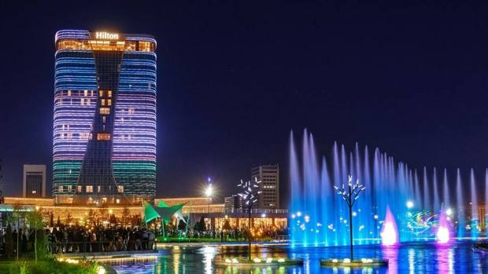
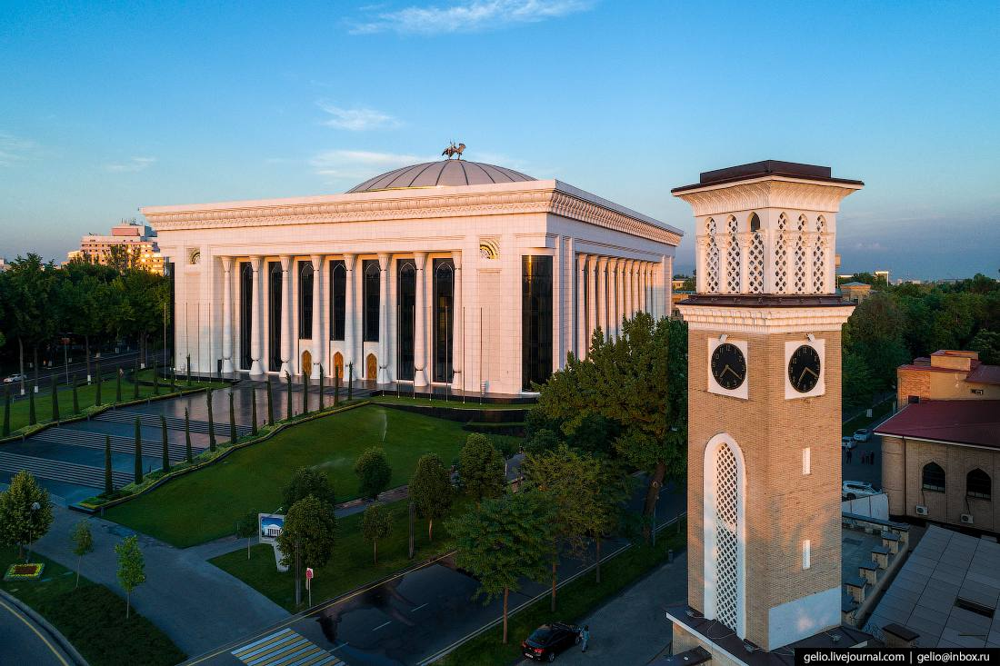
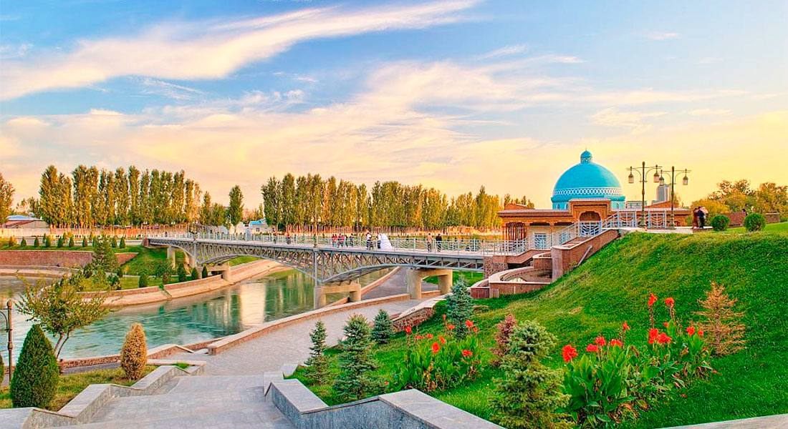
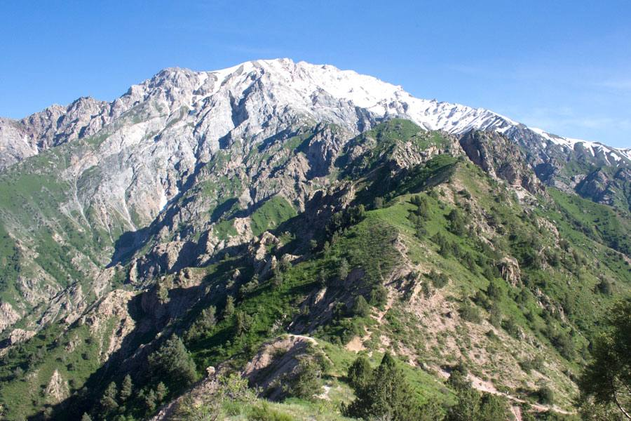
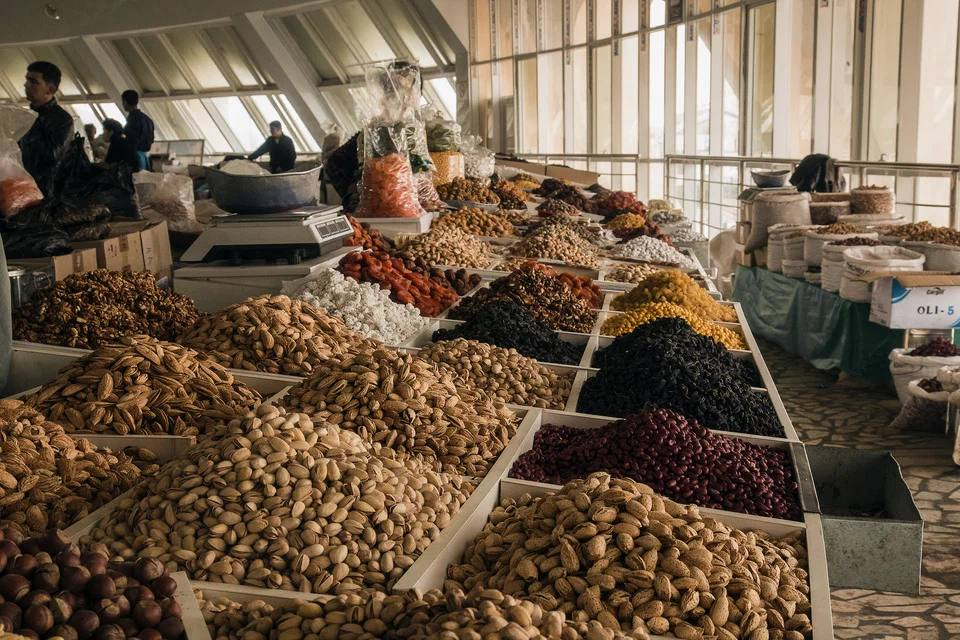
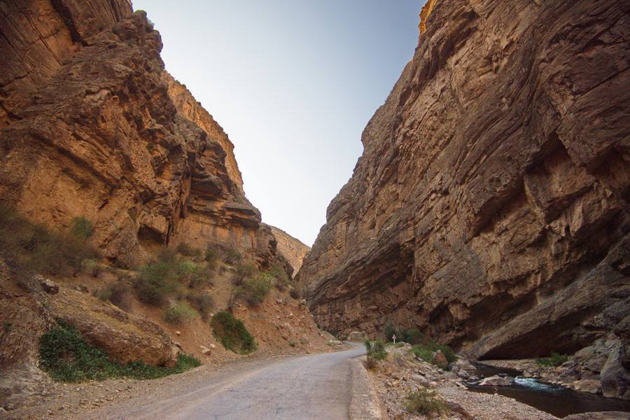
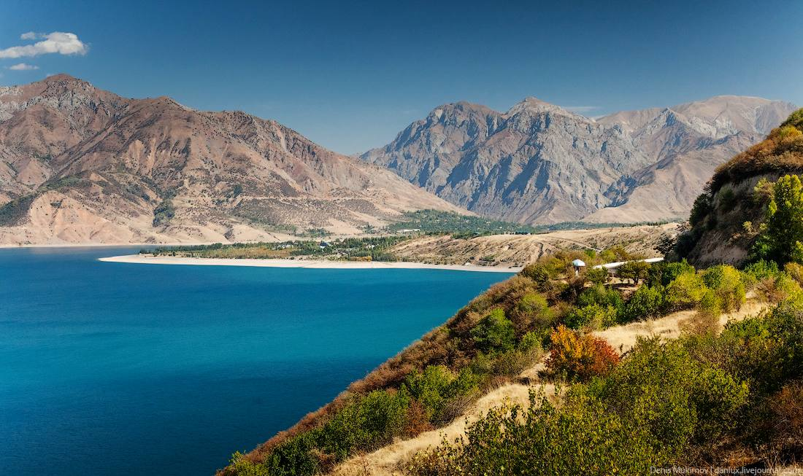

# Ташкент — это любовь. Как переехать в Узбекистан и стать там своим

Мы поговорили с разработчицей, всю жизнь прожившей в Ташкенте, и с менеджером по обеспечению качества, который только недавно переехал в эту страну. Узнали, каково это — жить на гостеприимной узбекской земле, какие там правила и как всё устроено. 

## Ильнура, фронтенд-разработчица из Ташкента: «Приезжайте к нам с идеями»

Меня зовут Ильнура, мне 25 лет. Я фронтенд-разработчица, в профессии уже почти два года. Пошла работать почти сразу после того, как окончила университет. Живу в Ташкенте всю жизнь. В свободное от работы время учусь играть на гитаре и хожу с друзьями на квизы.

Цель работать в IT у меня была со второго курса лицея — повезло с преподавателем информатики. Потом я пришла на подготовительные курсы по психологии в Ташкентский филиал МГУ. Мне сразу же стало понятно: хочу здесь учиться. Потом я узнала, что есть возможность выбрать не психологию, а IT-направление.

Мне уже тогда нравился фронтенд, я копалась в HTML и CSS, пробовала верстать сайты. Я поступила на «Прикладную математику и информатику» и погрузилась в эту область с головой.

На третьем-четвёртом курсе я задумалась: что делать дальше? Надо куда-то двигаться. Все мои знакомые стали работать по специальности — разработчиками разного профиля. Я прислушалась к себе и поняла, что больше всего мне нравится верстать сайты. 

Программирование нам преподавали все четыре года обучения, но меня этот предмет не сильно захватывал. Было интересно, но не настолько, чтобы целый день сидеть и писать код. Во фронтенд-разработке мне больше всего нравилось, что сразу виден результат: кнопка покрасилась, что-то появилось — моментальная визуализация.

### Рынок труда сейчас переполнен

Я впервые столкнулась с IT-отраслью, когда стала искать первую работу — почти два года назад. К собеседованиям я готовилась по многочисленным роликам на YouTube, кроме того прошла несколько публичных собеседований. Я повторяла теорию, готовилась к лайвкодингу. А на настоящих собеседованиях со мной просто говорили на общие темы и спрашивали базовые вещи. Это было странно. В результате из четырёх нанимателей все четыре сделали оффер, и я устроилась на работу в одну из этих компаний.

Сейчас ситуация с наймом сильно изменилась. Стали давать тестовые задания, проводить интервью в несколько этапов. Недавно я проходила собеседования в разных фирмах, и везде сейчас сложный процесс хайринга. Сначала были собеседования с психологом/HR, потом давали тестовое, затем проводили техническое собеседование.

Мне кажется, причина в том, что сейчас на рынке гораздо больше соискателей. Теперь после четырёх собеседований два работодателя перестают отвечать, а два других предлагают пройти дополнительные этапы. Достаточно большое количество откликов приходят сразу с отказом. Это наши, местные, не зарубежные компании. Не знаю, почему мне сразу отказывают. Могу предположить, что вакансий сейчас гораздо меньше, чем полтора года назад. Раньше на сайте hh.uz появлялись три новые вакансии в день, сейчас — в лучшем случае одна.

Возможно, рынок перенасыщен за счёт соискателей, приезжающих из России. С февраля 2022 года их стало довольно много. Приезжих можно заметить в общественных местах по разговорам: они обсуждают, что заблокированы карты МИР, VISA и говорят о том, как теперь вывести деньги.

Мне кажется, сейчас больше востребованы бэкенд-разработчики, популярны вакансии на Go. С фронтенд-вакансиями дела обстоят хуже. Ещё мне кажется, что в последнее время увеличилась потребность в грамотных проджект-менеджерах или аналитиках, потому что международные компании, которые теперь базируются у нас, активно их нанимают.

### Грейды очень субъективны

На местном рынке труда не так много специалистов высокого грейда по международным меркам. Синьор из Узбекистана — скорее, как миддл в России. Всё зависит от того, в какую компанию ты попадаешь. В одной компании тебя субъективно оценят как джуна, в другой — как миддла. Хорошие синьоры у нас надолго не задерживаются. Обычно ищут возможности релокации — в Россию и дальше в Европу, как Влад Тен. 

### Государство поддерживает IT в меру сил

>_Виды Ташкента_

У нас недавно заработал IT-парк, причём в виде нескольких филиалов в разных частях города. Это общая площадка для IT-компаний, но я бы не стала сравнивать её с российским парком Сколково, потому что здесь пока не осуществляются инновационные разработки.

Если IT-компания зарегистрирована в Ташкенте и она размещается в IT-парке, то получает много бенефитов от государства. Это налоги, субсидии, упрощённые процессы расширения штата и тому подобное. Государство выделяет средства на развитие индустрии. Недавно приняли стратегию «Цифровой Узбекистан-2030», в соответствии с которой реализуются программы цифровой трансформации регионов и отраслей.

Лично я радуюсь тому, что стало проводиться так много хакатонов, конференций, стартап-митингов и так далее. Много внимания уделяется образованию и трудоустройству в IT среди девушек. Недавно закончился хакатон для девушек [Tumaris.Hack](https://tumaris.tech/tumarishack) в честь нашей местной легенды из древних времён. В рамках хакатона участницам дали тему, на которую нужно придумать небольшой пет-проект. На разработку давалась примерно неделя. Разработка проходила под руководством менторов, проводились совещания, собрания. Моя знакомая участвовала и заняла первое место, получив приятный денежный приз.

Открылось много пространств-коворкингов. Туда можно прийти, покодить в удобной атмосфере. Хочется, чтобы их было больше, и чтобы за ними следили: хороший ли интернет, работают ли розетки.

### Удалёнка мало распространена, а у девушек спрашивают про замужество

У нас до сих пор не приветствуется удалённый формат трудоустройства. Работа на местную организацию — это офис, 9–6, 5/2. Удалёнка практикуется в компаниях, которые перебазировались в Узбекистан, например, EPAM. Почти весь их штат работает удалённо, но у них есть коворкинги по городу.

Agile и Scrum применяются только там, где есть толковые PM. Если такого сотрудника нет, эти заботы берут на себя разработчики, потому что им нужно отслеживать свои таски и т.д. Чаще бывает, что лиды — это просто разработчики, которые дольше работают в компании, больше знают и дольше пишут код.

Обычно лид должен менторить и ревьюить. Он может взять на себя ответственность, организовать отслеживание задач в Jira, проводить митинги. Я знаю синьора из одной компании, который всю жизнь там работает: он и программист, и тимлид, и DevOps, и архитектор. В общем, «человек — швейцарский нож»: за всем следит, всё контролирует.

Иногда традиции общества накладывают определённый отпечаток на найм и организацию труда. На собеседовании соискательницу могут спросить, когда она собирается выходить замуж и рожать. Для меня, как для человека, который продумывает свою жизнь наперёд, это обидный вопрос. Но с точки зрения бизнеса актуальный, потому что наши девушки достаточно рано выходят замуж. Продолжают ли они работать после замужества — зависит от семьи и девушки. Но чаще всего, если она из традиционной узбекской семьи, то после замужества скорее останется дома и будет домохозяйкой.

### К приезжим относятся хорошо, но просят проявлять уважение

Я не заметила никакого предвзятого отношения к мигрантам из России, не видела никаких гонений. В целом приезжие достаточно хорошо слились с толпой. В моей предыдущей компании многие были довольны притоком квалифицированных кадров из России. Это качественные специалисты, потому что школа здесь и школа там сильно отличается. Мне кажется, в Узбекистане всем рады. Возможно, начинающие специалисты, которые сейчас пытаются найти работу, немножко с обидой воспринимают, что конкуренция усилилась из-за приезжих. Но не настолько сильно, чтобы кто-то открыто проявлял негатив.

Специалистам из России удобно искать работу в Узбекистане, потому что почти все здесь говорят на русском. 80 процентов населения знают русский, по крайней мере в Ташкенте. Если даже не говорят, то всё равно поймут и объяснятся жестами. В работе используют оба языка, это зависит от компании. У нас практически все билингвы и говорят и на русском, и на узбекском. В зависимости от ситуации сотрудники будут переходить на нужный язык.

Когда начался массовый приток россиян, местные жители много помогали им с релокацией. Есть [канал в Телеграме](https://t.me/relocationuz), он появился в феврале 2022 года и сейчас уже насчитывает 25 тысяч подписчиков. Ещё есть такой 139 Documentary Center, его сотрудники поддерживали приезжих, помогают освоиться и найти жилье. Волонтёры помогали людям найти информацию, открыть карточки, обменять деньги.

Цены на арендуемые квартиры поднялись в два раза. Это ожидаемое явление, потому что все хотят заработать. Но всё равно у нас аренда ниже, чем в Москве.

Приезжие часто критикуют развитость инфраструктуры. Да, это ожидаемо, ведь вы приехали в другую страну. Вам придётся столкнуться с особенностями и с тем, что может чего-то не хватать. Например, платёжная система МИР заглючила, и россияне ругались на это. Думаю, можно не ждать, пока всё само заработает, а идти устраиваться в банки и чинить всё изнутри. Мы будем рады, если вы будете предлагать новые идеи и развивать инфраструктуру, которой у нас сильно не хватает.

Да, банковская сфера хромает, мобильные приложения оставляют желать лучшего, а первый маркетплейс запустился только недавно. В целом государство будет помогать стартапам, главное предлагать идеи и воплощать их в жизнь.

Можно развивать IT-комьюнити. Все будут довольны, если у нас будет проводиться больше конференций. Сейчас этого мало, хочется, чтобы было больше. Чтобы поучаствовать в крупном событии для фронтендеров, раньше надо было ехать в Санкт-Петербург, Москву или Иннополис.

Вам придётся перестраивать себя и забывать привычные вещи. У нас народ дружелюбный, никто вас камнями закидывать не будет. Но хочется, чтобы приезжие проявляли уважение к культуре и людям. Мне сказали, что очень непривычно видеть, как люди уступают место в метро. У нас это часть культуры: как только заходит женщина с ребёнком или пожилой человек, мы сразу уступаем, у нас так принято. Вся наша культура выстроена на взаимоуважении и поддержке друг друга. И ещё не удивляйтесь, если кто-то на улице вас окликнет братом или сестрой, потому что нам так проще обращаться.

Ещё у нас есть непривычная для россиян особенность шопинга. При оплате покупок на кассе в супермаркете кассир чаще всего спросит у вас пин-код от карты. Нередко это вызывает недоумение у приезжих, но местные живут так давно и привыкли. Всё дело в том, как устроены терминалы для оплаты. Кассиру проще самому ввести пин-код.

### Гостям в Узбекистане рады

>_Чимган, местные горы_

В целом на текущие расходы для одного человека 400 долларов в месяц будет более чем достаточно. Этого хватит, чтобы жить и ни в чём себе не отказывать. Конечно, в эту сумму не входит стоимость аренды жилья и коммунальные платежи.

У нас есть бары, рестораны, сфера общепита прекрасно развита. Есть даже кафе и рестораны, которые предлагают веганскую/вегетарианскую пищу, правильное питание и так далее. Их не очень много и стоит это дороже, чем обычно. Кофейни тоже встречаются почти на каждом шагу. Но нужно иметь ввиду, что не в каждом заведении будет Wi-Fi.

Есть гостиницы на любой вкус. Если вы не смогли сразу найти себе квартиру, можно арендовать номер на первое время. А ещё есть и каршеринг, и аренда машин на длительный срок.

Еда у нас вкусная и относительно дешёвая. Есть и супермаркеты, подобные «Пятёрочкам», и рынки. Рынки более популярны, потому что там выбор побольше и можно поторговаться, выбрать между разными продавцами. 

>_Рынок Чорсу в Ташкенте_

Одежда зависит от кармана. Если он не очень широкий — вам на рынок, там можно покупать вещи местного пошива. Есть большое количество заводов, которые шьют хлопковые вещи. Представлен и масс-маркет вроде Mango, Nike, Adidas и подобных марок. Эти магазины можно найти в ТЦ, которых у нас тоже немало.

Путешествовать по стране безопасно на 100%, хотя везде и всегда туристов пытаются развести на деньги. Самарканд, Бухара, Хива — это три основных туристических города. Очень рекомендую их к посещению! У нас развито авиасообщение внутри страны, ездят автобусы и скоростные поезда. Передвигаться можно и на машине, и пешком, как удобно. В туристических городах развитая инфраструктура, много гостиниц и есть что посмотреть. 

>_Нефритовые озёра Урунгач_

>_Каньоны в Сурхандарьинской области_

>_Бухара_

>_Хива_

>_Самарканд_

>_Чарвакское водохранилище_

У нас тёплый климат, есть горы, каньоны. В соцсетях можно найти себе компанию для туристической вылазки на природу. Специальная услуга: могут утром отвезти вас в горы, а вечером забрать.

Наше общество достаточно терпимо относится к открытой одежде на женщинах. Всё ещё не стоит носить слишком короткие шорты, если вы не хотите привлекать лишнее внимание, но камнями за это вас никто не забросает. 

## Из первых рук: впечатления релоканта

### QA engineering manager Андрей: «Ташкент приютил нас во время войны»

>_Андрей Соколов, QA engineering manager в компании Paynet. Создал отдел обеспечения качества «с нуля». Переехал в Ташкент в июле_

### Как я попал в Ташкент

Сейчас я работаю в компании Paynet. Моя позиция называется QA engineering manager, или, проще говоря, менеджер по обеспечению качества. На работу попал тривиально — меня нашла рекрутер и пригласила на интервью.

Я выбрал Узбекистан, потому что здесь мне предложили наиболее интересную позицию. А ещё мне важно, что Узбекистан дешевле Грузии и Армении, а тем более европейских стран. Решение принимал недолго: как только мы уточнили юридические аспекты моего переезда, я решил переезжать. Раньше я тут не был, но давно хотел побывать в качестве туриста.

### Впечатления, опасения и реальность

Я боялся радикального падения качества жизни после Москвы и предосудительного отношения местного населения ко мне как к россиянину. Кроме того, переживал за свою длинную бороду и татуировки :) Много чего из этого не оправдалось, хотя на бороду ташкентцы косятся.

Больше всего мне нравятся здесь продукты. Они превосходны, это яркое впечатление, фрукты и овощи с рынка прекрасны. Местная кухня очень вкусная, но очень тяжёлая для меня — к сожалению, я гипертоник и не могу питаться жирной пищей.

Как специалисту и представителю экономически активного населения, мне нравится, что Ташкент цветёт. Везде стройки, заметна инвестиционная активность, на каждом шагу какие-то мелкие предприятия и магазины, открываются парки и места общественного притяжения.

Здесь можно найти всё для комфортной жизни — Ташкент довольно дешёвый город. Но после объявления мобилизации в России заметно выросли цены на жильё — по ощущениям, процентов на 30. На продукты тоже — субъективно процентов на 10. Но даже при этом город остаётся довольно дешёвым. На текущий момент цены на жильё, похоже, падают, но не факт, что это надолго и рост снова не начнётся.

В Ташкенте колоссальная проблема с соблюдением ПДД. Нужно очень аккуратно переходить дорогу, водители скорее нажмут на газ, чтобы проскочить перед тобой на пешеходном переходе, чем пропустят. Повороты из крайней правой полосы налево — тоже обычное явление. Я считаю, что это объясняется относительной дешевизной авто и невысокими штрафами за нарушения ПДД.

Есть проблемы с энергетикой. Отключения света летом в жару и зимой в холода из-за нагрузок — довольно некомфортное явление. В холода есть проблемы с газом.
Видно, что государство работает над этим, лично президент Республики занимается вопросом. Надеемся, что будет результат.

В городе заметные проблемы с экологией, для чувствительных людей это минус — из-за строек столица Узбекистана регулярно попадает в топ-10 самых загрязненных городов мира. Вот, например, уровень загрязнённости воздуха на 17 октября 2022:

Проблем с социализацией у меня не было, я считаю себя умеренно коммуникабельным. Мой круг общения состоит на 90% из таких же релокантов. Так сложилось из-за разницы менталитетов. Местные коллеги часто семейные, и после работы им важнее побыть дома. Мне же хочется побольше гулять и изучать новое, сходить в какое-то заведение :) Хотя, конечно, в выходной могу и отсыпаться дома.

### Как здесь устроена работа в индустрии

У меня менеджерская позиция, поэтому меня наняли заниматься сложностями. В первую очередь — собрать команду, наладить процессы обеспечения качества, постепенно внедрить их, мягко преодолевая сопротивление изменениям. Мне очень повезло с коллегами — техническими менеджерами, поэтому я чувствую поддержку.

Наблюдалось некоторое непонимание у команды, а зачем, собственно, нужен специалист по обеспечению качества. Но постепенно ситуация прояснилась. Когда только пришёл, на первом же регрессе мобильного приложения сходу в одиночку нашел 36 багов :) В общем и целом мы с командой технических менеджеров работаем над внедрением улучшений. Резко это делать нежелательно, так как любые изменения — это стресс для команд.

Лично для меня, как для нанимающего менеджера, остро стоял вопрос подбора кадров: на местном рынке труда очень сложно найти кандидатов, которые удовлетворяют моим требованиям. В Узбекистане есть непонимание, что специалист по обеспечению качества — это такой же квалифицированный и подкованный технический специалист, как и разработчик. А может, и несколько больше — за счёт более широкого смежного кругозора.

За полгода работы мы достигли существенного прогресса в построении отдела обеспечения качества и организации соответствующих процессов. Удалось собрать команду специалистов и полностью укомплектовать штат отдела, в командах появилось понимание, зачем мы нужны, наладился релизный цикл, появилась документация и даже худо-бедно работает тестовая инфраструктура :) Разумеется, работа продолжается каждый день.

### Немного о сложностях в индустрии

На мой взгляд, принципиальный вопрос — слабая юридическая прозрачность при релокации. IT-визы — классная вещь, но непонятно, как они работают. Кому-то их выдавать готовы, кому-то — нет. А ещё не до конца понятно, кому выдаются IT-card. Да и кто на эти визы должен подавать — сам соискатель или работодатель, который приглашает его на работу — тоже неясно.

Нет понимания и того, в какой степени будут защищены члены семьи релоканта. Все это требует большей гласности и прозрачности механизмов взаимодействия с государством.

Ещё одна большая сложность — скорость разработки. В Узбекистане это особенность менталитета, а я, после вечно торопящейся Москвы, долго не мог к этому привыкнуть. В нашей компании мы работаем над ускорением разработки.

Наблюдается нехватка квалифицированных кадров в целом на рынке. Есть ощущение, что бизнес не готов много платить хорошим специалистам и обеспечивать их социальным пакетом. В итоге они покидают местные компании, уходят туда, где им могут предложить лучшие условия — социальные и материальные. Часто это заграничные работодатели — от российских IT-гигантов до западных компаний. Молодёжь активно учит английский язык и уезжает учиться за рубеж. Я бы рекомендовал обратить внимание на лучшие практики в этом отношении — в своей работе я стараюсь делать самые выгодные предложения, которые могу, ориентируясь не только на локальный, но и на мировой рынок труда.

### Пока что мой дом — Ташкент

Честно говоря, для меня не существует понятия Родины как такового. Я с уважением отношусь к людям, которые эту концепцию поддерживают, но сам воспринимаю государственную машину скорее как набор компетенций и сервисов. В какой-то момент я принял решение переехать в Узбекистан, и сейчас мой дом — это Ташкент.

Учитывая геополитическую ситуацию в мире и в родной стране, с моей стороны было бы нечестно сказать: «Я тут навсегда». Пока мой горизонт планирования — это полгода, и дальше этих нескольких месяцев я ничего не планирую. Сейчас я здесь и хотел бы заниматься тем, чем занимаюсь в компании Paynet. Я благодарен Ташкенту и Узбекистану, что он приютил меня и моих коллег-релокантов во время войны и всех геополитических потрясений.

Я тоскую по людям, которых оставил в России или за её пределами, так как многие разъехались по миру. Стараюсь общаться с ними через мессенджеры, а ещё посещаю психотерапевта. Кстати, настоятельно рекомендую заниматься и прорабатывать психологические проблемы, это очень помогает. Не стигматизируйте психотерапию, как это принято в консервативных обществах. В сообществе релокантов есть даже шутка о том, что релоцироваться нужно вместе со своим психотерапевтом.