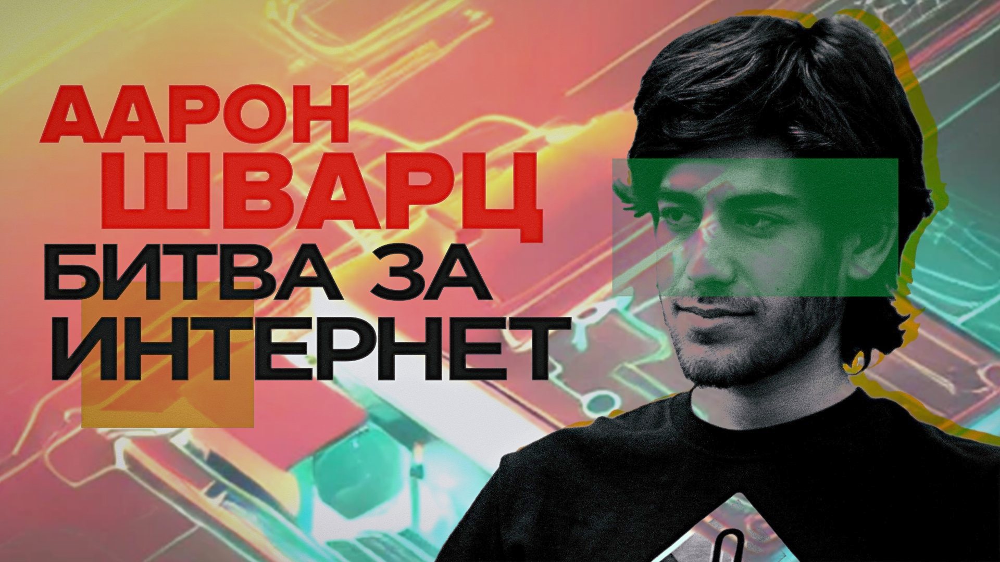

# Аарон Шварц — битва за интернет – Легаси

Этот подкаст называется Легаси, мы делаем его вместе с Катей Петровой, которую вы знаете по подкасту Подлодка или работе над Котлином. Мы здесь будем рассказывать самые охренеть какие невероятные истории нашей индустрии.

Пилотный выпуск — про Аарона Шварца, программиста вундеркинда, который мог направить интернет по совсем другому пути, если бы прожил дольше.

Он был в команде разработки RSS уже в 13 лет, а в 15 — помогал запускать лицензию Creative Commons. Стал сооснователем Реддита и миллионером, будучи подростком. Создал Markdown, WebPy и много чего еще.

Но в 20 лет бросил индустрию, ушел в политический активизм. Но не выдержал борьбы с государством и жесткого преследования по абсурдному обвинению. Рассказываем его историю.

[oembed](https://youtu.be/h5GXJd7ALkk)