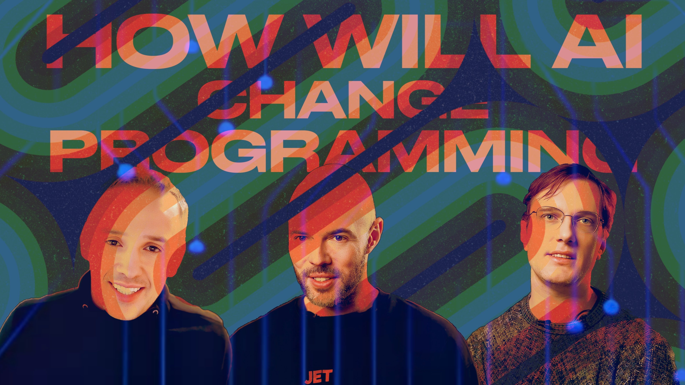

# How will AI change Software Development — Insight from Top-Notch Engineers

Ну молодцы, ребята, поздравляем. Автоматизировали все нормальные интересные профессии. Рисует теперь ИИ, стихи тоже пишет, все умеет, все знает. Скоро и фильмы снимать начнет, и книги писать. Победили гуманитариев, красавцы. Пусть ходят теперь, побираются.

А что с программированием станет? 

Когда уже копайлот будет на ваш код смотреть как на говно? Когда GPT вам пол-отдела сократит?

Вот посмотрите, мы намонтировали красивый, доходчивый, взвешенный, экспертный и в меру скептичный видос. Если вкратце — программирование с нами навсегда, можно выдыхать.

Заходите, смотрите. Вдвойне будем благодарны всем, кто поупражняется в своем безупречном английском в комментах и покажет видос всем вашим многочисленным (двум-трем) друзьям в разных странах.

[oembed](https://www.youtube.com/watch?v=S8y0DA-nJBQ)