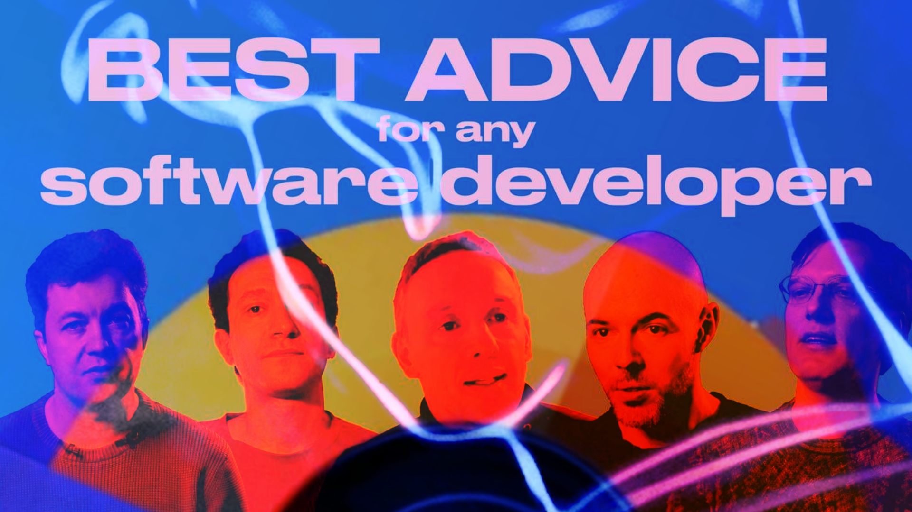

# How to Become a Great Software Developer — Best Advice from Top-Notch Engineers

То, что мы сейчас покажем — это малюсенькая демоверсия грандиозной штуковины, над которой мы работаем уже который месяц. Первый шажок к проекту, о котором я лично мечтаю хрен знает сколько лет.
 
Все наши эксперименты с форматами, подкастами, интервью, статьями, то, как мы уже который год учимся рассказывать истории про нашу индустрию разными голосами, собираем весь свой опыт и людей вокруг — чтобы прямо со всей силы сделать скачок в качестве и уровне. 
 
В общем, посмотрите на это видео.
 
Конкретно в нем мощнейшие умы нашей индустрии — Андрей Бреслав, Дмитрий Жемеров, Роман Елизаров, Егор Толстой, Павел Веллер — делятся своими мыслями, что значит быть по-настоящему крутым разрабом.
 
Но, я думаю, по форме и масштабу вы и сами поймете, к чему мы тут клоним, над чем работаем и что совсем скоро выложим.
 
А пока — по-братски — зацените, покажите друзьям в разных странах. Мы тут хотим сделать штуку, которой реально сможем гордиться.
 
[oembed](https://www.youtube.com/watch?v=suATPK45sjk)