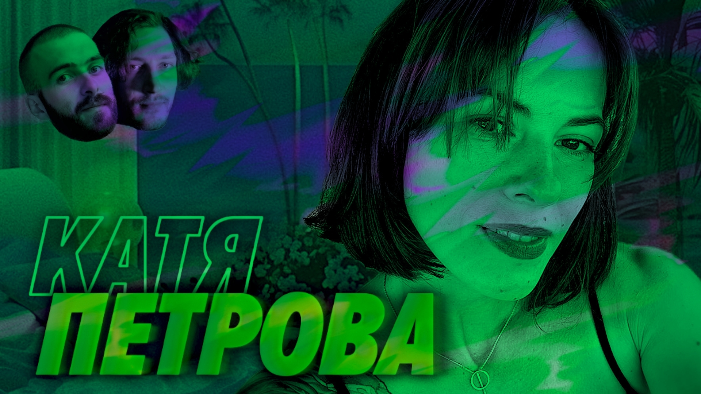

# Что если трудности не делают нас сильнее — Катя Петрова — Мы обречены

Я не знаю, что это за магия, но каждый раз, когда к нам приходят ребята из Подлодки — у них в жизни начинает всякое происходить. 

У нас был Женя Кателла, мы поговорили — и тут же его затянуло в водоворот смен работ и стран. Выпуск за считаные дни растерял актуальность, даже выкладывать пропал смысл (но у нас на патреоне, бусти и спонср, кстати, он есть). Пришел Егор Толстой — и хоп, эксэпшенл талент виза, привет Лондон, прощайте Нидерланды.

Но раньше всех к нам приходила Катя Петрова, и вот уж как ее потаскала жизнь — это отдельная история. Сегодня она про все и расскажет. Там жестко.

И кстати, зацените наш новый подход. Мы теперь не просто готовимся к выпуску и продумываем план разговора — мы делаем это под запись. Сможете увидеть, какую титаническую работу мы проделываем, чтобы подкасты получались такими продуманными и глубокими.

[oembed](https://www.youtube.com/watch?v=deO82QTT3WE)