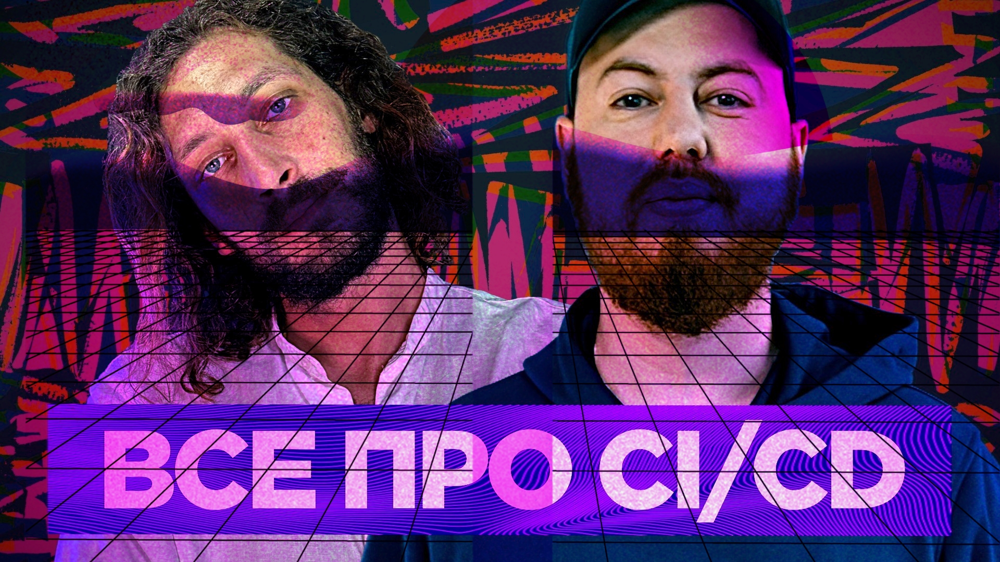

# Сложно ли работать над CI/CD и можно ли его доделать раз и навсегда

Инфраструктурные роли все сложнеют и сложнеют, чтобы разрабовские становились легче. Вот, например, Виктор Попов руководит целой командой, которая делает CI/CD как сервис для разрабов Samokat.Tech. Он сегодня расскажет, насколько это дело тяжелое.

Обсуждаем, как на самом деле делают CI/CD в серьёзных компаниях, как не сойти с ума от возрастающей сложности, падений, и ответственности — а вместо это работать методично, размеренно и с удовольствием.

[oembed](https://www.youtube.com/watch?v=f_LF-x9V3WM)

