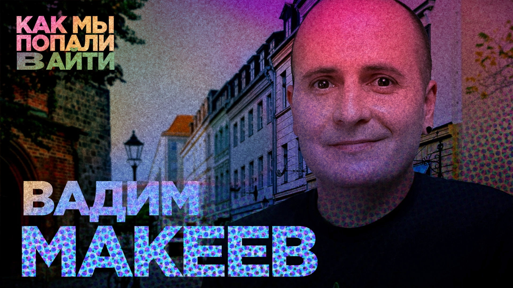

# Как пройти веб-разработку путем здорового человека — Вадим Макеев — Как мы попали в IT

Вадим Макеев — один из лучших примеров для подражания в веб-разработке. Супер скилловый, идейный, человек который сохраняет интерес к техническому прогрессу в сфере на протяжении многих лет и помогает сохранять его другим. 

Работа в Opera, Mozzila, проект Doka, лучший подкаст о фронтенде Веб-стандарты и многое многое другое.  

Но когда-то и Вадим был начинающим разработчиком и делал свои первые шаги. Как именно — в новом выпуске Как мы попали в айти.

[oembed](https://www.youtube.com/watch?v=NfGdb3HVlns)