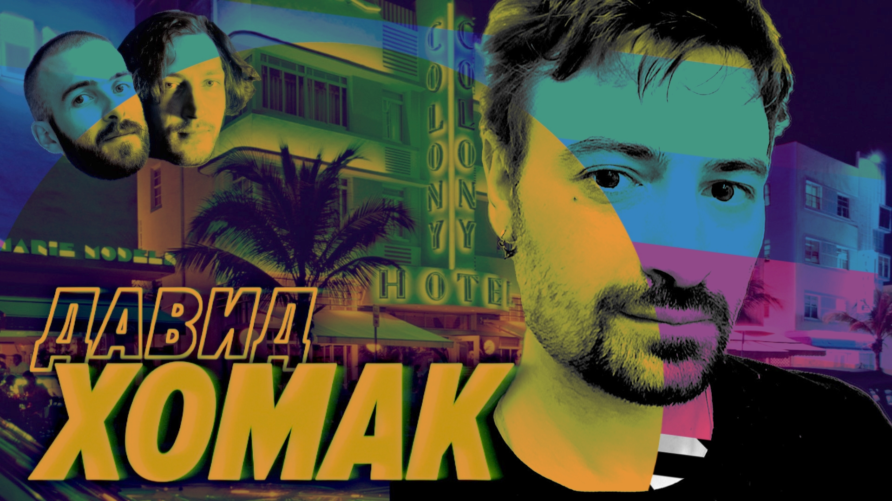

# Башог, Лурк и времена, когда в интернете не было людей (и роскомнадозора) — Мы обречены

Легенда старого рунета. Давид Хомак, создатель Лурка, рассказывает на «Мы обречены» про то, как ему в личку твиттера писал бухой глава РКН и просил перестать стебаться.

[oembed](https://youtu.be/yNiwecVn-fg?feature=shared)