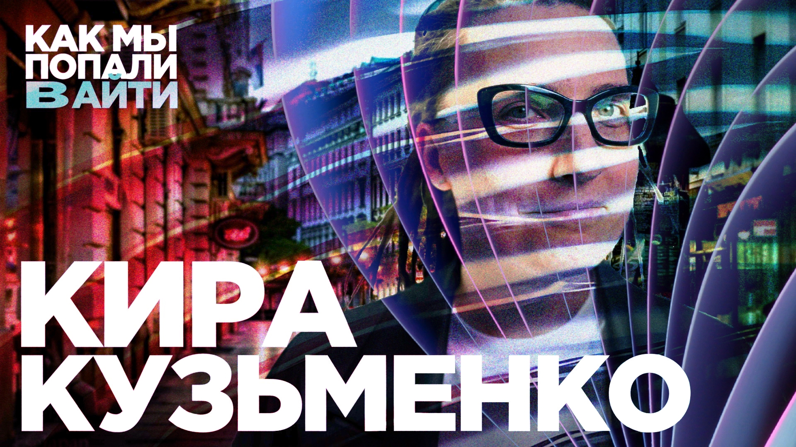

# Как стать крутым IT рекрутером и HR-ом — Кира Кузьменко — Как мы попали в айти

Сейчас Кира Кузьменко — одна из самых известных экспертов по рекрутингу в нашей индустрии. У нее свое международное рекрутинговое агентство, сервис анонимного поиска работы, куча каналов с вакансиями с огромными охватами и отличные регулярные аналитические исследования айтишного рынка.

Но когда-то и она делала свои первые шаги и училась быть рекрутером на ходу, сама набирая себе команду. В новом выпуске «Как мы попали в IT» она расскажет про свою карьеру, а вы наберетесь полезного чужого опыта. Вин-вин.

[oembed](https://www.youtube.com/watch?v=0_Zfmc7AWtM)

