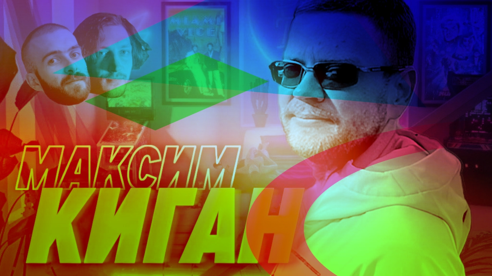

# Суровый уральский походник и iOS-разработка — Максим Киган #

Ну вот реально — сейчас бы ну ее нахрен всю эту работу, таски-шмаски, сраные проблемы, дурацкую рутину. Поперек горла уже. Вот бы в лес, да с палаткой, с лучшими друзьями, по речке сплавиться, а вечером у костра, с водочкой, с гитарой, а на утро снова идти и дышать полной грудью. Идешь, смотришь на красоту и ни про что кроме ходьбы не думаешь. Из всех тяжестей на плечах — рюкзак да и все.

В общем, заходите помечтать в наш новый выпуск, наполненный походной романтикой. Не каждый день встретишь iOS-разработчика, который в этом сечет.

[oembed](https://www.youtube.com/watch?v=Zk30C0eiW6Q) 