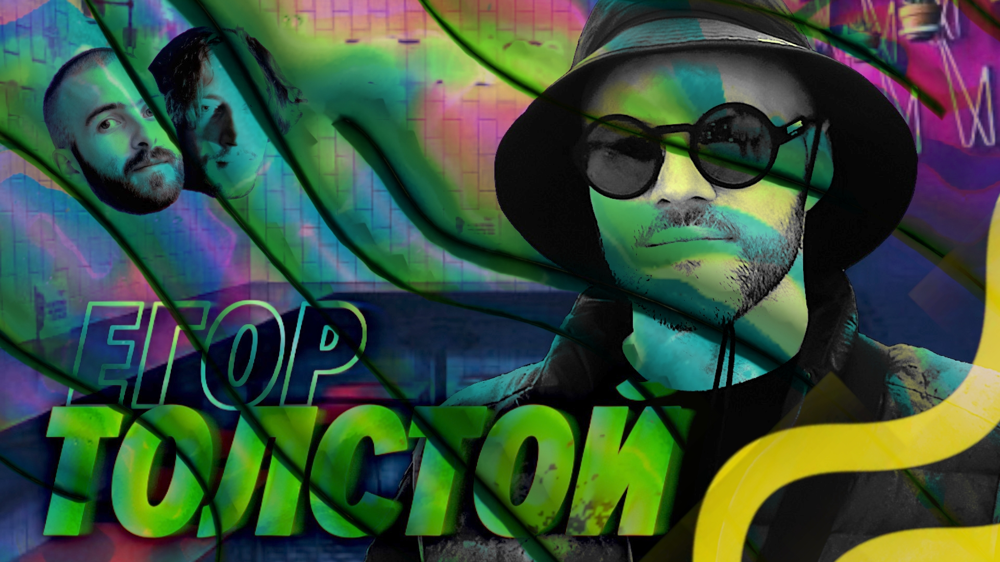

# Кто теперь главный по Котлину? — Мы обречены

Неиссякаемый кроссовер — мы и Подлодка. Это в подкастерстве мы противоположности, но в реальности — добрые приятели. Надеемся, до конца света соберем у нас в гостях их всех — и вот сегодня Егор Толстой.

Это теперь, вообще-то, сверхбольшая шишка в нашей индустрии. Он унаследовал от Андрея Бреслава и Романа Елизарова продуктово-менеджерскую часть всего Котлина.

Вот мы и поболтали — как это так, бывший айосник теперь возглавляет главный язык для андроид разработки (а заодно поплакали и помянули его заряженную Бэху Х3).

[oembed] (https://www.youtube.com/watch?v=BvLrHld1TEg)