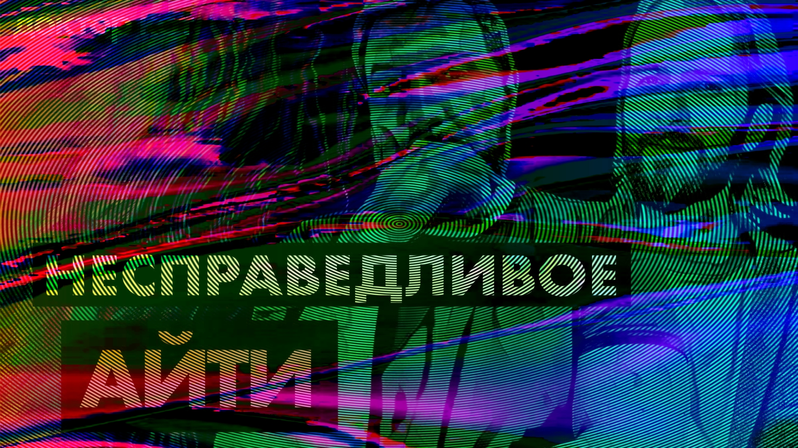

# Лиды против подчинённых, несправедливые увольнения и другие кейсы из комментов — Доктор Кот

Перед съемкой новых выпусков Доктора Кота мы созвонились и сделали постскриптум для прошлых. Почитали комменты, вытащили оттуда несколько интересных мнений и историй — и пообсуждали.

Общей темы для них задумано не было, но она выявилась сама. Очень многое дерьмо начинается с чувства несправедливости. Как тебя не поняли, неправильно оценили, плохо обошлись, нагрузили сверх меры, нечестно уволили и чего еще похуже.

Справедливость — вообще штука сложная и противоречивая, и читая ваши комментарии, мы попытались копнуть в ее суть поглубже.

Заходите, смотрите и начинайте потихоньку думать — а не написать ли вам тоже нам письмо (конечно, написать, тут даже думать нечего). Можете просто рассказать историю своей нелегкой карьеры, через какие испытания шли. Можете написать историю конкретного происшествия.
Можете просто задать какой-нибудь вопрос. Что вас беспокоит — а мы попробуем ответить.
А можете вообще поделиться любыми мыслями, какие наболели — не обязательно про себя. В целом про мир, индустрию, за жизнь. Нам тоже будет интересно почитать и обсудить в будущих выпусках.

[oembed](https://www.youtube.com/watch?v=ms0DYqg9fyY)