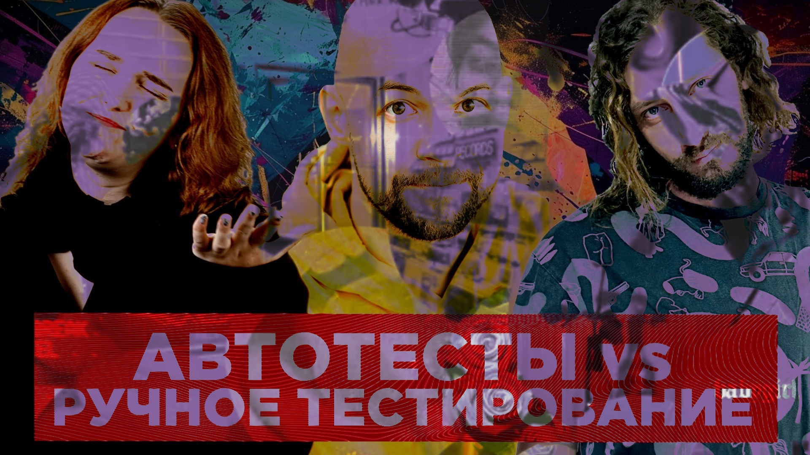

# Надо ли автоматизировать все ручное тестирование – Александр Кузьмичев – Спортмастер ЛАБ

Этот выпуск Разрабы подкаста — не просто выпуск, а почти дебаты. Фил, Василиса Версус и Александр Кузьмичев из SM Lab спорят, как быть с ручным тестированием.

Надо ли автоматизировать вообще все тестирование? Какие применять стандарты и общие практики в тестировании? Все плюсы минусы и подводные камни обоих подходов.

Заходите, смотрите, подключайтесь к дискуссии

[oembed](https://youtu.be/F69cLb1gNDI)