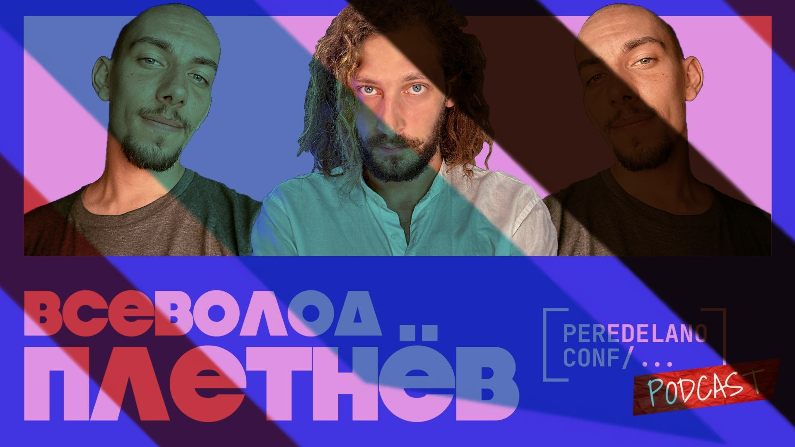

# В сравнении с тем, что мы видим за границей — дома было просто 

Из подкаста «Мы обречены» за четыре года выросло много чего.

Сообщество, другие шоу, несколько первых людей из нашего чатика при ютуб-канале стали с нашей подачи известными в индустрии, мы обзавелись доброй тысячей хороших друзей, стали очень большими, помогли куче ребят с их проектами — а я вот ещё и создал проект с конфами для айтишников по всей планете.

Вокруг тех конф выросли сообщества, мы кое-как начали учиться жить на новом месте, искать смыслы, двигаться вперёд, активно работаем над диаспорой

Ещё один виток этой работы — я сделал новый подкаст, в котором беру гостей своих ивентов, мы обсуждаем, где и как живётся, что можно сделать, как нам получше объединиться и построить что-то вместе.

Один из таких гостей — Сева — охуенный чувак, с которым мы за полгода стали добрыми друзьями, захуярил нам конфу в Казахстане, пожил на Кипре, и теперь вот прилетел ко мне на Пхукет — записались с ним офлайн, заходите, послушайте!

[oembed](https://youtu.be/nOcbMQWSYIM)
