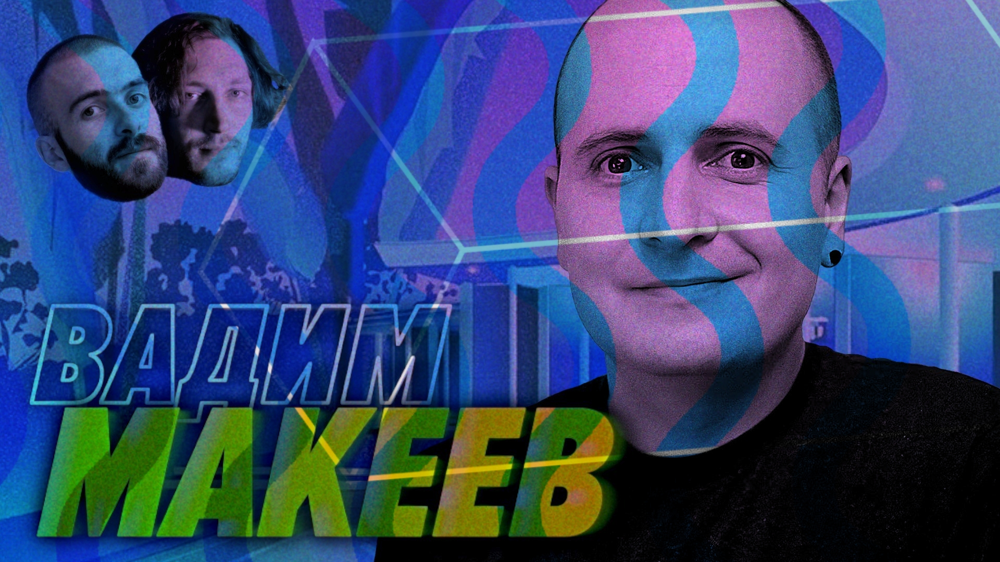

# Дрожите, бэкендеры, бойтесь — JavaScript приходит за вами — Вадим Макеев — Мы обречены 

Мы со своим подкастом попали в список самых популярных Эффектов Манделы — почему-то всем запомнилось, что Дарт Вейдер говорил «Люк, я твой отец», Ельцин сказал «я устал, я ухожу», Фредди Меркьюри пел of the world в конце we are the champions, а Вадим Макеев уже был у нас на подкасте.

А вот прикиньте, не был. Вот вы сейчас все ринетесь искать — мол, как же так, мы же смотрели, он там даже говорил про браузеры и джаваскрипт.

А вот нифига. Вадим Макеев пришел к нам впервые, на пятом году подкаста. Нас это конечно не красит, но исправляемся. Долгожданный разрабовский выпуск про разработку 

Правда в конце мы все равно будем ныть и пускать слезу. Ну блин, хотя бы не весь выпуск. 

[oembed](https://www.youtube.com/watch?v=g76e4DCy9u0)