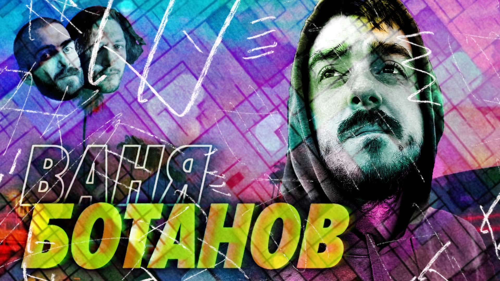

# Амбассадор оставшихся айтишиков — Ваня Ботанов и уехавшие — Мы обречены

Нет более задолбавшей темы, чем уезжать или оставаться. Хорошо сказали где-то, что кто не сходил по этой теме с ума два года назад — у того нет сердца, кто продолжает по ней сходить — у того нет ума.

Все для себя все решили и поняли. Кто уехал, тот уехал, кто остался, тот остался. Самое сложное сейчас нормально по-человечески всем со всеми говорить. 

Вот и мы решили норм поговорить. Позвали нашего давнего кореша Ваню Ботанова, который остался дома и не понимает, чего мы уехали и бесимся там в своих твиттерах.

Где-то поспорили, где-то согласились, без лишнего дерьма.

[oembed](https://www.youtube.com/watch?v=PpiKsgsYZCY)