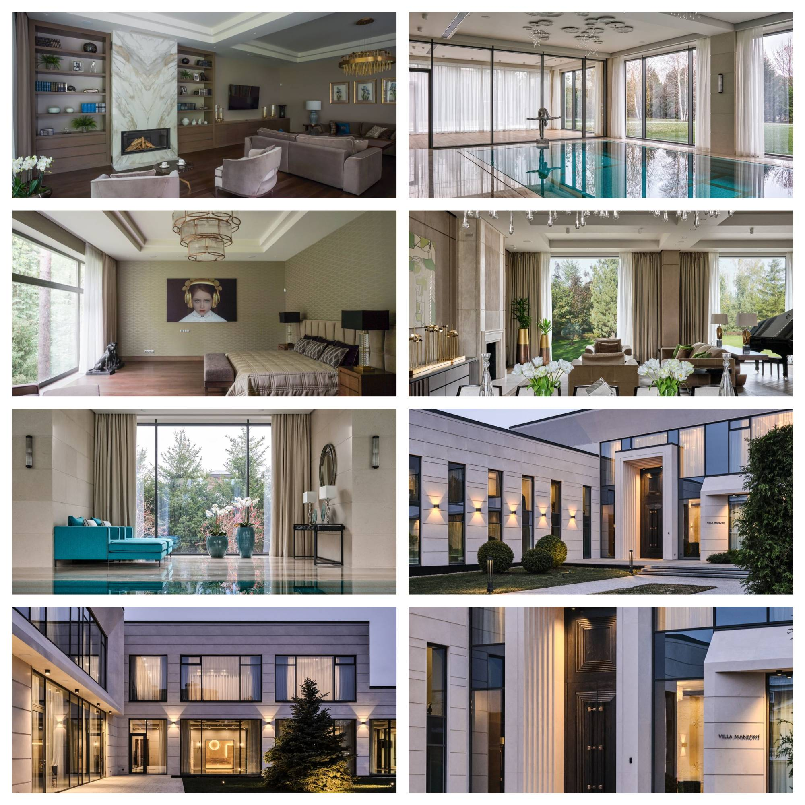

## Почему я перешла в Урбанистику. И как променяла Рублёвку на Воткинск 

Каково это — на пять месяцев стать местным жителем маленького города и увидеть его изнутри?

Урбанистка Ксения Гаврилова расскажет историю о том, как важно вовремя услышать свою интуицию, когда привычная карьера больше не «наполняет», самое смелое (и правильное!), что можно сделать — менять всё.

### Глава первая. Куда девается радость

Шесть лет назад я столкнулась с парадоксом. Чем лучше я становилась в своей работе, тем меньше она приносила радости. Я не знаю, сталкивались ли вы с этим чувством, но для меня оно стало неприятным сюрпризом.

Шёл 2019 год. На тот момент, у меня за плечами уже была классная пятилетняя карьера в строительстве. В качестве руководителя строительства, я работала с элитной недвижимостью на Рублевке. Это домики от трёх тысяч м2 и себестоимостью от 10 млн долларов. Неплохо, да?

Это были дома для частных заказчиков на Рублёвке и Жуковке. Каждый объект — уникальный, создавался по индивидуальному плану. Всё эксклюзивно, красиво, заказчики довольны. Множество прекрасных контрагентов, партнёров, успешных в своём деле, которые очень помогли мне и потом, когда я ушла из заказного элитного строительства. Но всё-же на Рублёвке мне глубоко внутри чего-то не хватало. 

Я поймала себя на мысли, что по-настоящему загораюсь только в одном случае: когда проект не про частные резиденции, а про общественные пространства.

Например, реновация маленькой кофейни в центре Москвы. Видеть, как люди приходят сюда каждое утро, как пространство объединяет их, становится частью их жизни...

Это было совсем другое ощущение. Настоящее. Живое.

### Глава вторая. Чего же я хочу

Я всегда тянулась к проектам, которые реально меняют жизни людей. Знакома фраза: «сначала мы создаём среду, а потом среда создаёт нас»?

Я буквально ощущала это каждой клеткой.

Мне хотелось работать не для одной семьи, не для корпорации, а для тысяч людей.

Примерно в тоже время я наткнулась на Vision Zero. Эта программа зародилась в Швеции в 1997 году. Её цель — нулевая смертность на дорогах.

Фундаментальные принципы:
- Любое ДТП с жертвами = недоработка проектировщиков, а не «ошибка человека».
- Дороги должны проектироваться так, чтобы максимально исключить аварии.
- Безопасность важнее скорости и удобства для автомобилей.

Меня поразило, что довольно простыми методами можно существенно снизить смертность на дорогах. И я ушла изучать эту программу: где и как обучают на таких специалистов, как это применимо к России и могу ли я сама стать к этому причастна. 

И результат ошеломляющий.

Швеция, 2023: 22 погибших на миллион жителей — самый низкий показатель в ЕС. Средний показатель по Европе: 46 погибших.

Для Швеции 22 жертвы в год — это национальная трагедия. Они не считают это нормой. А мы? 

Я поняла, что хочу заниматься чем-то подобным.

Но, если в строительстве я уже чего-то достигла, то в урбанистике была «полный ноль». Нужно было идти стажироваться бесплатно и набираться опыта. Но я не понимала, где искать варианты и как добиться своего.

Внезапно, мне очень повезло: я попала на консультацию по карьере в урбанистике, где подсветили мои сильные стороны и доказали, что в  урбанистике я очень даже нужный персонаж. И буквально спустя месяц я увидела сообщение урбаниста о поиске специалиста на тогда ещё не запрещённом Facebook. 

Он искал человека, который умеет всё, Ну, или хотя бы вот это (список из 10+ пунктов). Описал, что не любит делать, например, работать с документами и другие штуки, в которых я хороша. Я написала дерзкое сообщение, мол, «я _ идеальный кандидат».  На следующий день он мне позвонил. Так началась новая глава моей карьеры.

Он рекомендовал меня своим коллегам, и, уже довольно быстро я начала понимать, что могу дать и чего хочу в урбанистике — влиять на процессы, управлять ими, а не просто быть рядовым исполнителем.  Но я не представляла, как я, руководитель стройки, буду управлять урбанистическими проектами? И кто вообще доверит мне большой, серьёзный проект без опыта в этой нише? Но оказалось, что работа в элитном строительстве дала мне серьёзный опыт, как реализации сложных проектов, так и понимания психологии людей, умение выстраивать процессы.

Так уже спустя полгода я стала руководителем проектов в новой нише.

### Глава третья. Зачем мне этот Воткинск 

"Ксения, ты серьёзно? Какой ещё Воткинск??"

Коллеги не понимали, зачем я променяла московские частные проекты на небольшой город под Ижевском. Но внутри меня было абсолютное понимание, что я двигаюсь в верном направлении.
И вот я еду в Воткинск, городок в самом сердце России, оставив всё прошлое позади. Взялась за проект реновации местного Берёзового леса. Да, не имея за плечами никакого опыта в качестве руководителя проекта в этой сфере и такого масштаба.

Возможно вы, слышали об этом городке: он известен тем, что в нём спустили на воду первый корабль в дореволюционной России. А ещё тем, что это родина Чайковского… 

Именно в таком городке ты чувствуешь искреннее желание людей заботиться о своём месте, делать его лучше. Воткинск напрямую граничит с огромным берёзово-сосновым лесом — главной местной достопримечательностью. Сам лес занимает занимает 45% всей территории Воткинска, и местные жители этим очень дорожат.  

Под мягкий убаюкивающий шум самолёта, меня накрыли воспоминания из детства, когда тринадцать лет назад я совершала турне по Дальнему Востоку.  

Приехав в Воткинск, меня сразу поразила разница и контраст в восприятии, между Москвой, и этим городком под Ижевском, раскинувшемся на берегу прекрасного озера.

В моей команде было 14 человек, включая куратора, но командой проекта также считается администрация, регион и эксперты, активные жители. То есть коммуникация получилась довольно обширной.

Мы сняли для команды один их немногих в городе отелей. Командировка была с довольно плотным графиком встреч и активностей, многие из которых запланировали заранее. На улицах сами подходили к людям, много раз беседовали с администрацией, активистами, местным бизнесом, встречались с мером, изучали историю города и его территорию.

Уникальным и нетипичным для российских реалий стал проект реновации территории леса. Заказчик — местные жители! Невероятно, да? На личной встрече с горожанами я сразу почувствовала их прочную связь с этим местом.

На встрече присутствовали представители разных групп: члены местного яхт-клуба, спортсмены и лыжники, владельцы домашних животных, молодые родители, и пенсионеры. 
Как въедливо и тщательно они изучали каждую деталь плана предстоящего благоустройства, и с каким энтузиазмом задавали мне уточняющие вопросы. Это было поразительно!

«Нам нужна новая трасса для лыж и коньков», — просили спортсмены и лыжники. 

«А новая детская площадка будет?», — спрашивали родители.

«Не забудьте про обустроенные тропы и дорожки для прогулок и бега», — вторили любители собак.

«Обустройте нам уже наконец береговую линию», — просили молодые люди и яхтсмены. 
Каждое моё предложение вызывало жаркую дискуссию.

«Только смотрите, не троньте наш лес, чтобы он остался в сохранности», —  лишний раз с опаской твердили хором местные жители —, «...а то мы вас знаем!!!»

И их можно было понять: ничего другого ждать от «строителя и архитектора из Москвы» им не приходилось.

Но в Москве ты никогда не чувствуешь, что твой парк рядом с домом — по-настоящему твой. Однажды ты просыпаешься и внезапно обнаруживаешь спиленные деревья вместо любимого сквера. Или разрытую спортивную / детскую площадку во дворе собственного дома. Да и зачастую в Москве мы даже не знаем соседей ни в лицо, ни, тем более, по именам.

Москва слишком необъятна. Такой огромный город, парадоксально, но не способствует формированию по-настоящему прочных связей. Деловых — да, но не человеческих. И безумно огорчает, что в большом городе, месте, в котором ты родился и вырос, ничего по-настоящему тебе не принадлежит. Большой город учит тебя, что ничто по-настоящему не обладает ценностью, ничто не вечно. В любой момент, что угодно может быть перестроено, разрушено и отнято без твоего согласия и даже ведома.

Проект благоустройства в Воткинске, в этом смысле, был прямой противоположностью. Такой инициативности и энтузиазма от моих новых заказчиков, я, пожалуй, никогда до этого ещё не наблюдала.

Каждый шаг утверждали и апробировали с помощью карт, рендеров и пользовательских сценариев на местности в разные времена года. Да, мы учитываем, что зима, весна лето и осень имеют разные сценарии использования территории. Это крайне важно закладывать в проект изначально. 

И именно в этот момент я осознала, чего мне так не хватало в моей предыдущей «частной работе» в Москве — связи и ощущения сопричастности с проектом, который создаёшь.

Коллеги по частной застройке на Рублёвке спрашивали: «Зачем, Ксения, ты поехала в глушь, провинциальный городок, названия которого никто толком не знает? Что ты там забыла?». И тогда я не знала, что им ответить. А теперь — знаю.

В результате этого проекта каждая группа людей почувствовала своё соавторство и сопричастность. Мы подарили им очень классное чувство связи с местом, сделали эту территорию принадлежащей им.

Теперь сами жители сохраняют это чувство сопричастности с территорией, берегут её и продолжают развивать. Такие проекты показывают, что люди готовы участвовать в решении этих вопросов.

Важно помнить: урбанистика без людей — это лишь благоустройство. Без привлечения людей на этапе планирования и девелопмента (разработки), проект теряет душу, становится обезличенным, и непонятно: для кого это всё в итоге, делается.

### Эпилог

Проект в Воткинске оказался не единственным:

- 2022 год: три победы на конкурсе «Малые города и исторические поселения», включая Воткинск.
- 2023 год: ещё три на Дальнем Востоке.

- 2024 год: пять городов, четыре победы тоже на Дальнем Востоке.

А также я регулярно консультирую коллен по вопросам конкурса и нюансам.

Восемь городов за два последних года у меня были на Дальнем Востоке, в Приморском крае, Амурской области. И это потрясающе, потому что в 2023 году у меня в работе был достаточно большой для Дальнего Востока Благовещенск. А в 2024 году население самого большого составляло всего 150 тысяч. А большинство участников конкурса были сёлами с 6 тысячами населения.

Делая такой проект ты на 100% уверена, что каждый житель этого города им воспользуется. Чаще всего это какие-то знаковые локации, которые используются на всех городских праздниках. Мне, конечно, очень нравится заниматься таким. 
Параллельно у меня появлялись проекты в других странах. Сейчас — в Грузии и Индии, где я продолжаю заниматься развитием территорий, и это очень увлекает. Вся моя деятельность теперь — улучшать качество жизни вокруг. 

В Индии мы работаем с застройщиком храмового комплекса. Сдали проект в 2024 году. В Грузии разработали глэмпинг — это такой комфортный гостиничный формат кэмпинга. А ещё начала консолидировать людей, связанных с урбанистикой. Провожу лекции, менторинг, организовываю сообщество. 

Я переехала, но проекты в России остались, и я не планирую с ними расставаться. Мне очень нравится заниматься развитием территории в России, потому что в них очень легко измерить, что же изменилось. «Малые города» мы делаем по конкурсу, и своими глазами видим, как картинка оживает. Если город победил, проект просто не могут не выполнить, потому что это грантовая программа с обязательной реализацией. Это своего рода магия. Сначала перед тобой маленькая деревня. Непонятно, что же тут может быть? Потом погружаешься и понимаешь, как интересно, какая здесь история, как много всего можно воплотить. Потом вы побеждаете, вместе радуетесь, разрабатываете проектную документацию с архитектором. И ждёте когда проект реализуют. И через два года после победы можно поехать и увидеть, что же получилось.

В этом году я не знаю, будут ли такие российские проекты у меня в работе. Это зависит от бюджетирования регионов. Но если пригласят, то с удовольствием присоединюсь. 

Строительство элитных особняков — это статусно. Но вот что я поняла: если ты сделал хороший проект для «малого города» — он точно изменит жизнь людей. Ты знаешь, что каждый житель увидит и воспользуется тем, что ты создал. И это бесценно.

