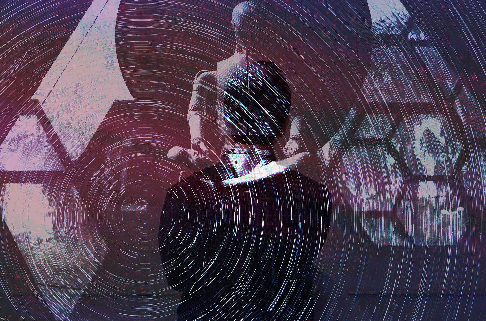

# Разраб — кто ты, что с тобой стало, что с тобой будет

В 2016 году мир взбудоражили два стартапа из России и Беларуси. Это были приложения, которые украшали фото и видео всякими забавными эффектами — приделывали собачий нос или маску знаменитости на лицо, превращали фото в картину в стиле какого-нибудь художника. Тогда для людей это выглядело как магия. Фоткаешь, тапаешь — и получается круто! Приложения прославились и засели в топах скачиваний, на их создателей посыпались деньги и супер возможности.

Для людей, не связанных с IT, эти стартапы и истории их создателей стали витриной, красивым инстаграмным постом того, чем занимаются «айтишники». Новое, непонятное, но прикольное. Я тогда тоже смотрел на это, как на новый рок-н-ролл. Молодые ребята сколачивают команды, выбирают себе название, качают скилл, придумывают вещи, которые завоевывают внимание людей, веселят, развлекают, делают жизнь приятнее, а потом купаются в деньгах. 

Единственное — мне не нравилось, как про технологии пишут и рассказывают техноблогеры и ИТ-журналисты. Они, как мне казалось, слишком мало вникали в технологии и слишком много размусоливали про финальные продукты. Поэтому техноблогеры и ИТ-журналисты казались мне скучными обзорщиками телефонов, профессиональными покупателями, гидами пользователя информационных технологий. Людьми, которые в погоне за мелочами, не замечают гораздо более важные вещи.

Мне хотелось, чтобы кто-то залез внутрь ИТ-индустрии и в головы ее участников, рассказал не о продуктах, а про инструменты; разобрался, о чем и как там разговаривают между собой, что рассказывают друг другу разрабы, когда не надо объяснять вещи простым языком на пальцах «для пользователей». Видят ли они тот же витринный рок-н-ролл, который видит остальной мир, тапая по кнопочкам их веселых приложений?

В 2018 году мне выпал шанс сделать это самому. К тому времени я уже набрал кое-какой скилл и опыт рассказчика и устроился редактором на Хабр — как мне тогда казалось, главное и самое большое медиа для разработчиков. Но для них это было скорее не медиа, а сообщество, где все делятся опытом — техническим, карьерным и житейским. Я же пришел со своей идеей экзистенциальных поисков смысла, историй и контекстов, которые все объяснят. У меня было море энтузиазма, и я еще не знал, что на этом пути будет гораздо больше тупиков, серых зон, неожиданных поворотов и разочарований, чем открытий.

-----------

Но это потом, сначала было весело. 

Я хотел говорить об инструментах, а не о продуктах; о том, что под капотом технологий, а не на поверхности — и я начал копаться. Ходил по разным сообществам, которые объединялись вокруг языков и фреймворков, и расспрашивал, расспрашивал, расспрашивал. 

Сообщество F# оказалось дружелюбным — им очень хотелось заразить любовью к своему языку всех остальных. Сообщество Хаскелистов наоборот — холодным, неприветливым, очень скептически настроенным к популяризации и вообще попыткам человека со стороны рассказать о чем-то по вершкам. Рубисты отказывались признавать уходящую популярность их языка, хотя кажется почти все остальные пытались их в этом убедить. Джаваскриптеры тогда только и разговаривали что о битве своих фреймворков, до посинения спорили реакт или ангуляр, и почти во всех разговорах ругались, в какое место и как глубоко надо засунуть редакс. 

Мне на почту десятками падали письма с мнениями о том и этом, личка забивалась сообщениями, а память телефона — записями диктофона. Я вникал и вникал в контекст, набирался баззвордов. Сместить акцент в рассказах с продуктов на инструменты, как я и хотел, оказалось вообще несложно. Хуже того, продуктов и результатов работы программистов вообще как будто не существовало.

Я почти не слышал в разговорах “что” делать — только “как”. Меня это даже насторожило. Людям как будто было вообще плевать, над чем они работают. Интересны только тонкости реализации, способы и те самые инструменты. О том, что конечный продукт тоже важен, соглашались как будто из одного приличия. О реализациях и процессе говорили с гордостью и огоньком. О продукте — как будто стесняясь: «ну там, в банке, какой-то сервис пилим» 

Открыв для себя занавес, которым ИТ индустрия закрылась от обывателей и пользователей, я увидел совсем не то, что ожидал. Вместо романтичной картинки с новым рок-н-роллом и авангардом прогресса я увидел мир галер, потогонки, одинаковых бессмысленных задач, промышленного конвейера, переписывания одного и того же ради денег, выгорания, рутины, непонятных споров ради споров и зацикленности на обывательских проблемах — где сколько платят, как правильно собесить, кто синьор, а кто джун, у кого комфортнее, какой выбрать стул, какая клавиатура лучше. 

--------------

Но концентрируясь на одних сторонах, всегда теряешь общий фокус. Конечно, ИТ оставалось гораздо большим явлением, чем ежедневное двигание тасок в джире. И я продолжал исследование.

Те самые стартаперы, которые в 2016 «взорвали интернет» и оккупировали сторы своим приложением с нейросетями и фоточками — в 2018 про них, и про их приложение, казалось, уже все забыли. Но я вспомнил и решил рассказать их историю — где они, и что будут делать дальше. Я надеялся, что может быть здесь я найду тот самый рок-н-ролл, который себе напредставлял.

Но во время подготовки к интервью во мне поселилась мысль, которая мучает до сих пор. Произнесенная вслух, она сразу растворяется. Она не выдерживает никакой критики, она рушится от любого осмысления, она ломает своей неловкостью большинство разговоров. Но даже сто раз опровергнутая она остается в глубине души эмоциональной болячкой, занозой, которую хочется вытащить, но нельзя подцепить.

Я до сих пор не нашел ей идеальной формулировки, но в тысячный раз попробую:

Лучшие ученые умы мира уже десятки лет введут сложнейшую исследовательскую работу на пределе человеческих возможностей. Академики, математики, инженеры кладут жизнь на развитие умопомрачительно сложных технологий. На их плечах стоят еще тысячи умнейших людей, которые находят прикладные применения академической работе. Из земли буквально достают железо, которое превращают в микросхемы, по которым бежит электричество — да так хитро — что через много-много слоев абстракции это электричество буквально начинает подчиняться словам, введенным на клавиатуре. Это невероятное достижение открывает пути миллионам талантливейших, умнейших и предприимчивых людей.
Они впитывают в себя опыт предшественников, проводят бессонные ночи за обучением, осваивают сложнейшие языки программирования, используют передовое оборудование, и чуть ли не фантастические нейросетевые алгоритмы, распределенные по мировой сетевой инфраструктуре из дорогущих вычислительных машин — чтобы я, держа в руках передовое устройство, собранное по частям на заводах всего света… 

…сфоткал своего кота, украсил это фото затейливым узорчиком и хихикнул.

Как-то это мелковато, нет?

Я попробовал сформулировать эту мысль на интервью, добавив к ней наглый вопрос. «А не кажется ли вам, что со всеми этими ИТ-стартапами вы занимаетесь какой-то переусложненной чепухой?» 

Ответ, который я получил тогда (и который получал еще много раз) только усугубил мои мучительные поиски. Звучит он примерно так:

«Никогда не знаешь, какое применение найдут технологии, придуманные для развлечения людей. Сегодня мы разрабатываем приложение для обработки фоточек, и тебе кажется это пустой тратой ресурсов, но завтра те же самые технологии, которые разработали мы, применят для поиска лекарства от рака или развития автопилотов. Люди, которые набирались опыта на — как ты говоришь — “чепухе” возможно через пять лет будут писать код для запуска ракет в космос или чего-то еще, что даже у тебя не повернется язык назвать чепухой. Все переплетно намного плотнее, чем ты думаешь, и мир гораздо сложнее, чем тебе кажется».

Я верю в этот ответ, но не до конца, и не всегда. Иногда он звучит в моей голове, как попытка пустить пыль в глаза. Но я вынес из него другую важную мысль про ИТ.

# В мире технологий все всегда применяется не так, как было задумано.

--------------------

На этой идее строится даже популярный сериал «Кремниевая долина». Парни делают какую-то глупую приложеньку и между делом, совершенно случайно пишут революционных алгоритм сжатия данных. Но это оптимистичное явление работает и в другую сторону.

Пару лет назад я писал серию репортажей о масштабном конкурсе технологических команд. Их задачей было изобрести систему, с помощью которой спасатели будут искать пропавших в лесу людей. Это оказалось сложнейшим инженерным вызовом. Лес — абсолютно непробиваемая для технологий среда. Там пропадает связь, беспилотники не видят ничего сквозь кроны, тепловизоры получают сплошную тепловую кашу, нейросети теряются в море данных. 

Десятки инженеров, которые думали, что щелкнут эту задачу как орешек, вылетали из конкурса друг за другом, потому что ничего не получалось. Но это было интересно, и мне казалось, что задача очень важна, а найденная технология принесет море пользы.

Я опубликовал статью, и комментаторы тут же разрушили мой наивный оптимизм. «Наверняка военные сейчас сидят, следят за конкурсом и с нетерпением потирают руки» — писали они. Сейчас, в 2022 году, стало понятно, что такая технология действительно попадет к военным гораздо быстрее, чем к спасателям, и применят ее точно не для того, чтобы спасать человеческие жизни.

И что нейросети, распознающие лица для того чтобы повесить на них маску котика, будут применяться не только в автопилотах, но и в камерах слежения на улице. Что инфраструктурные находки высоконагруженных развлекательных приложений будут использованы не только для вычислений данных об исследованиях рака, но и для обработки персональных данных, формирующих фундамент социальных рейтингов в авторитарных государствах.

Одни и те же пустяки превращаются и в добро, и в зло. 

Когда не знаешь, как применят технологии, которые ты разрабатываешь — возникает сложный моральный вопрос. Продолжать ли мне выполнять свою работу, если результаты могут использовать во зло? Ответы которые я слышал почти всегда — «Прогресс не остановить», «Если сделаем не мы, сделает кто-то еще». «Пользы в итоге все равно будет больше, чем вреда» и прочее прочее прочее. 

Этот ответ казался мне общественным консенсусом индустрии — полуосознанный отказ от этики. Мы не просто управляем бездушными машинами, мы не просто пользуемся инструментами — мы и есть бездушные машины, мы и есть инструменты. Мы не стрелки, мы ружье. Мы не разрабатываем информационную цифровую систему, не управляем ей и не направляем ее. Мы сами система. Вы — пользователи. Вам и отвечать. Последствия технологического прогресса — не наша забота. 

В какие-то моменты мне даже казалось, что самый сложный этический вопрос, перед которым могут поставить себя разрабы — «а готов ли я работать в каком-нибудь гэмблинге и скаме за х3 от моей зарплаты». И все шло, как шло. Люди со стороны все так же видели ИТ сложной индустрией прогресса, творящей цифровую магию. Люди изнутри — промышленный конвейер, где вопрос «как сделать» важнее, чем «что сделать» и «зачем сделать», где обычные разрабы просто делают свою работу, эффективно или неэффективно выполняют таски. Владельцы компаний и стартапов — и дальше считают развитие прогресса побочным эффектом развития бизнеса. 

Я — все так же ходил среди людей, наблюдал, фиксировал настроения, собирал контекст и пытался осмыслить — что же такое для современного мира ИТ-индустрия. Правда ли то, что я увидел. Или это очередная моя выдумка, как новый рок-н-ролл. 

Сейчас, когда мир снова заигрывает с идеей тотального контроля, подчинения и самоуничтожения, вопрос о месте и значении ИТ в мире стал еще сложнее. И после нескольких лет наблюдений я понимаю еще меньше, чем раньше. Кто вы теперь? Рок звезды? Очередные экономисты-юристы? Умы которые изменят мир? В какую сторону? Слепые исполнители чужих засмыслов? Или осознанные творцы прогресса? Инструмент или мастер? Ружье или стрелок?
Что с вашим сообществом? Того местечково-международного, объединенного опенсорсной лингвой франкой, которую теперь считают имперским оружием, больше нет?
Вы теперь диаспоры? Вы живете в цифровом мире, который сами строите? Или вы меняете реальный мир?

Кто вы? Что с вами стало? Что с вами будет?

И это не риторические вопросы. Я хочу быть не просто наблюдателем, а заразить этими вопросами и вас. Меня насторожила инерция с которой вы развиваете технологии, фаталистское равнодушие, когда технология начинают применяться во вред. Я верю, ваше осмысление и осознание места и роли в мире может все перевернуть — потому что на самом деле это вы контролируете технологии, и вы направляете прогресс.
