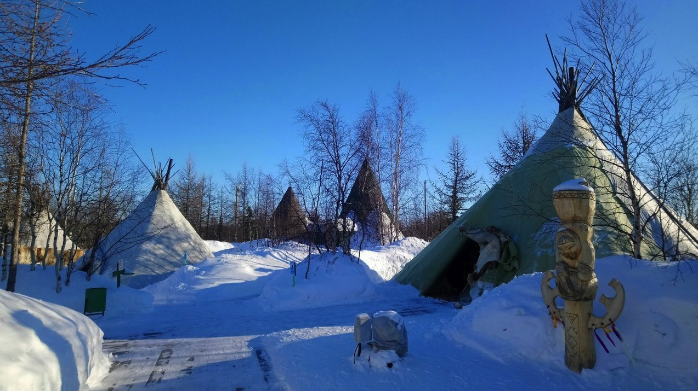
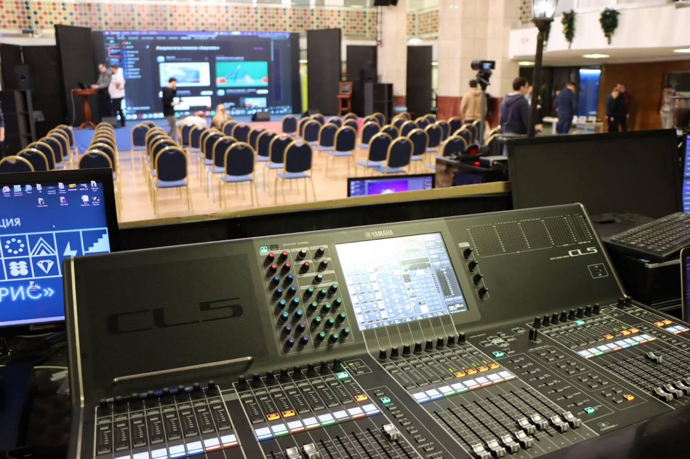
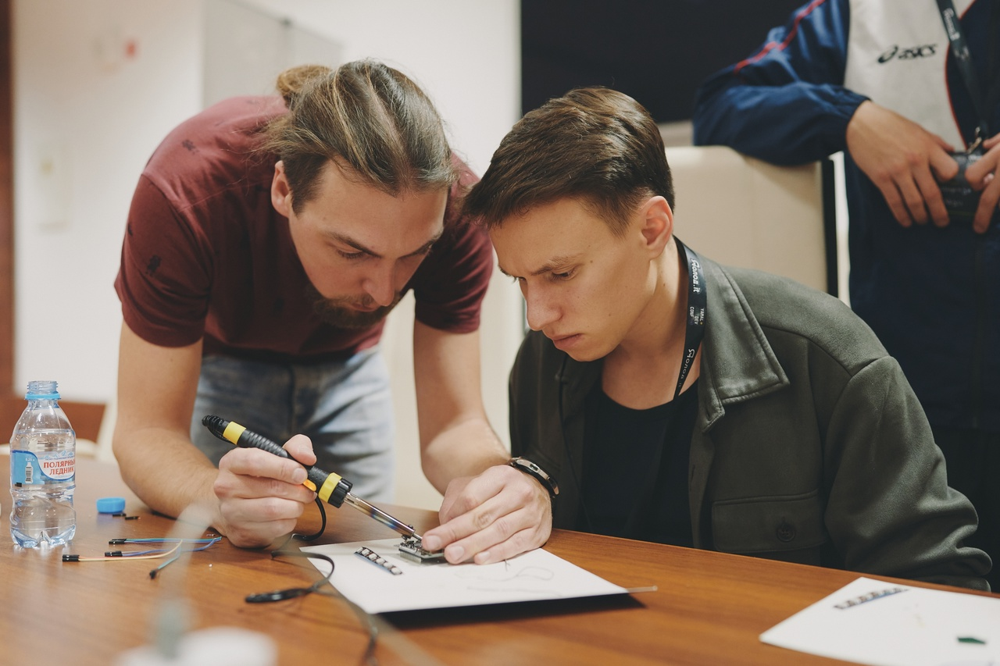
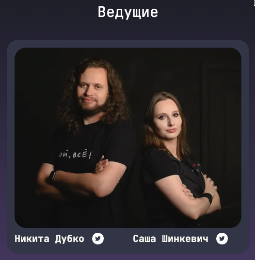
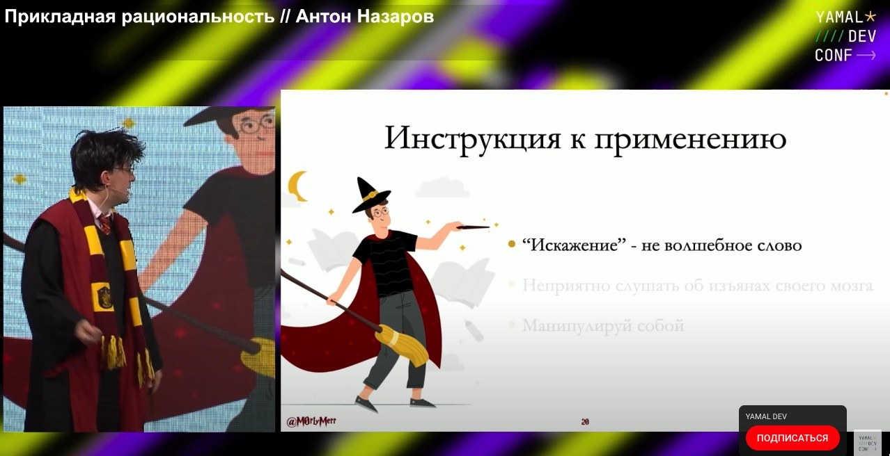
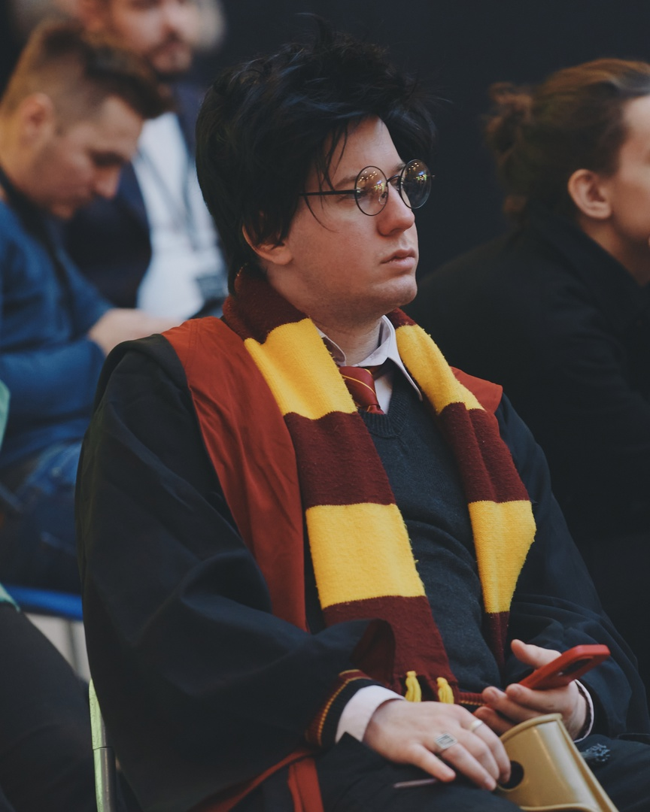

# YAMAL.DEV CONF — Север, дикий дубак и ИТ

Привет! Хотим поделиться с вами тем, как прошла в начале ноября наша северная YAMAL CONF. Это уже вторая конференция, которую мы собираем, чтобы развивать IT-комьюнити на Севере и делиться знаниями.

В этот раз мы немного увеличили масштаб по сравнению с 2021 годом и сделали два насыщенных дня — 5 ноября у нас было 7 докладов и 3 воркшопа, а 6 ноября — 6 докладов и тоже 3 воркшопа. Собственно, под катом — немного наших личных впечатлений и планов, фотки, полезные для сообщества ссылки и YouTube-плейлист со всеми 13 докладами.

___

В первый день мы решили показать спикерам местный колорит и организовали для них поездку в этнический музей. Посидеть в чуме, когда вокруг неслабый ветер и -20, это всегда хорошо.

>Внутри на самом деле гораздо теплее

Отрадно было слышать обратную связь от гостей и спикеров — мы на самом деле сильно постарались, что не осталось незамеченным: оценивали как технический рост (сами доклады, появление интересных воркшопов, preparty + afterparty, во время которых можно было пообщаться со спикерами, так и организаторами (в этот раз видеосъемку вели профессионалы на три камеры, да, всё как у взрослых).

>Было и такое, да

>Воркшопы стали важной частью конференции

А ещё мы очень рады, что у нас постепенно появляется постоянная IT-тусовочка из спикеров и ведущих. Например, YAMAL CONF 2022 вели Никита Дубко и Саша Шинкевич (Саша выступила и в роли спикера с докладом “Необычные браузерные API”).

Одним из спикеров был Антон Назаров с докладом “Прикладная рациональность”. Одна из фишек Антона (помимо отличных докладов) — он приходит на конференции в костюмах известных героев. 

Например, если вы были на прошедшей недавно в Питере Saint TeamLead Conf 2022 — он был в костюме Ведьмака. К нам он приехал в образе Гарри Поттера, ибо костюм Ведьмака в сборе весит порядка 30 кг, да и мечи в самолет не пронесёшь просто так.

Для себя из второй конференции мы вынесли главное — хоть мы и на все сто довольны, но теперь четко осознаём, что при увеличении масштаба события (больше спикеров, больше докладов, больше воркшопов) необходимо пропорционально увеличивать и команду организаторов. А мы в этом году всё делали силами той же команды, что и в прошлом.

Расширение же даст возможность и чуть лучше (и с меньшим напрягом) готовить и саму площадку, и спикеров — больше прогонов, больше репетиций, более отточенные временные рамки и насыщенные доклады. Записали всё это себе в беклог, так что следите за анонсами третьей конференции :)

## Полезности
Прежде всего — обещанный плейлист со всеми докладами YAMAL DEV CONF 2022

1. [Татьяна Ерёмина — Как мы развиваем айтишников](https://www.youtube.com/watch?v=C4z2W6DX5HQ&list=PLC0EL4FwYtD8LNK_NfskY0SFSFjq_CfY4&index=2&ab_channel=YAMALDEV)
2. [Сергей Попов — Основы психологического здоровья](https://www.youtube.com/watch?v=dEflAPb29Vw&list=PLC0EL4FwYtD8LNK_NfskY0SFSFjq_CfY4&index=3&ab_channel=YAMALDEV)
3. [Семён Левенсон — Коммуникация между разработчиками и дизайнерами](https://www.youtube.com/watch?v=M5lEIntqrUE&list=PLC0EL4FwYtD8LNK_NfskY0SFSFjq_CfY4&index=4&ab_channel=YAMALDEV)
4. [Павел Соколов — Рабочие процессы продуктового дизайнера](https://www.youtube.com/watch?v=Ht-BDQe24VY&list=PLC0EL4FwYtD8LNK_NfskY0SFSFjq_CfY4&index=5&ab_channel=YAMALDEV)
5. [Антон Назаров — Прикладная рациональность](https://www.youtube.com/watch?v=oJQlcvATpGI&list=PLC0EL4FwYtD8LNK_NfskY0SFSFjq_CfY4&index=6&ab_channel=YAMALDEV)
6. [Надя Крутикова — Как войти в IT feat Никита Горчаков](https://www.youtube.com/watch?v=HnWhTApR0sk&list=PLC0EL4FwYtD8LNK_NfskY0SFSFjq_CfY4&index=7&ab_channel=YAMALDEV)
7. [Андрей Шубин — ML в электронной коммерции Оно вам надо](https://www.youtube.com/watch?v=9OpdD5vRr8s&list=PLC0EL4FwYtD8LNK_NfskY0SFSFjq_CfY4&index=8&ab_channel=YAMALDEV)
8. [Андрей Смирнов — Высококонверсионные собеседования](https://www.youtube.com/watch?v=DUw-2qIl3hc&list=PLC0EL4FwYtD8LNK_NfskY0SFSFjq_CfY4&index=9&ab_channel=YAMALDEV)
9. [Александра Прокшина — Выход из замкнутого круга, как bitrix разработчику перейти на программирование](https://www.youtube.com/watch?v=B_B_cIJgl8E&list=PLC0EL4FwYtD8LNK_NfskY0SFSFjq_CfY4&index=10&ab_channel=YAMALDEV)
10. [Александр Смирнов — Продуктовый подход на практике и как он помогает в командной разработке](https://www.youtube.com/watch?v=1boYQkjzF8o&list=PLC0EL4FwYtD8LNK_NfskY0SFSFjq_CfY4&index=11&ab_channel=YAMALDEV)
11. [Антон Егорушков — Инфраструктура как код](https://www.youtube.com/watch?v=gTgTG2bHNE4&list=PLC0EL4FwYtD8LNK_NfskY0SFSFjq_CfY4&index=12&ab_channel=YAMALDEV)
12. [Анна Ширяева — Опускаемся ниже: нужен ли компаниям low-code?](https://www.youtube.com/watch?v=aS22lp_Bd4I&list=PLC0EL4FwYtD8LNK_NfskY0SFSFjq_CfY4&index=13&ab_channel=YAMALDEV)
13. [Саша Шинкевич — Необычные браузерные API](https://www.youtube.com/watch?v=GBRCrDPCX4g&list=PLC0EL4FwYtD8LNK_NfskY0SFSFjq_CfY4&index=13&t=1843s&ab_channel=YAMALDEV)

[Сайт конференции](https://conf.yamal.dev/)

[Сообщество YAMAL CONF ВКонтакте](https://conf.yamal.dev/) - подписывайтесь, если вам интересно развитие северного IT-комьюнити.

[Природно-этнографический комплекс в Горнокнязевске ](https://www.tourister.ru/world/europe/russia/city/salekhard/museum/31875) — для желающих прикоснуться к природе Севера (ну и в чуме чаю попить).